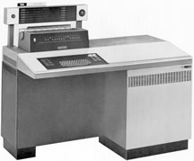
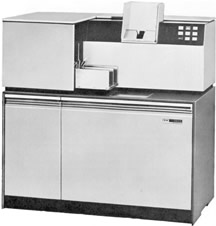
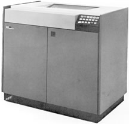
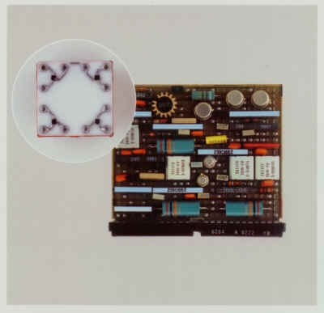
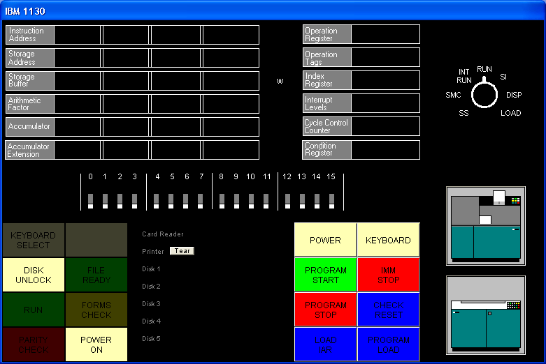

# SIMH IBM 1130 Emulator and Disk Monitor System R2V12 Reference Guide

Revision of 23-Nov-2012

**Copyright Notice**

The SIMH source code and documentation is made available under a
X11-style open source license; the precise terms are available at:

<https://github.com/open-simh/simh/blob/master/LICENSE.txt>

The IBM 1130 emulator and documentation were written by Brian Knittel.
This document remains marked as a work in progress.

# Table of Contents

[1. Introduction to the IBM 1130](#introduction-to-the-ibm-1130)

[2. The Emulated 1130](#the-emulated-1130)

[3. Files Included with the Emulator](#files-included-with-the-emulator)

[3.1. SIMH Users](#simh-users)

[3.2. Standalone Users](#standalone-users)

[3.3. What's in the ZIP files](#whats-in-the-zip-files)

[4. Installing the Emulator](#installing-the-emulator)

[4.1. Installing on Windows](#installing-on-windows)

[4.2. Installing and Building for Other Operating Systems](#installing-and-building-for-other-operating-systems)

[5. Using the Emulator](#using-the-emulator)

[5.1. Emulator Commands](#emulator-commands)

[5.2. DO Scripts](#do-scripts)

[5.3. Drag and Drop](#drag-and-drop)

[6. Emulator Commands for Peripheral Control](#emulator-commands-for-peripheral-control)

[6.1. The CPU](#the-cpu)

[6.2. Console Printer and Telnet Support](#console-printer-and-telnet-support)

[6.3. Line Printer](#line-printer)

[6.4. Disk Drives](#disk-drives)

[6.5. Card Reader](#card-reader)

[6.6. Card Punch](#card-punch)

[6.7. 1627 Plotter](#plotter)

[6.8. Paper Tape Reader/Punch](#paper-tape-readerpunch)

[6.9. 2250 Graphics Display](#graphics-display)

[6.10. Synchronous Communications Adapter](#synchronous-communications-adapter)

[6.11. 2741 Terminal Support](#terminal-support)

[7. The Emulator Display](#the-emulator-display)

[8. IBM 1130 Disk Monitor System (DMS) Release 2 Version 12](#ibm-1130-disk-monitor-system-dms-release-2-version-12)

[8.1. Booting the Emulated IBM 1130](#booting-the-emulated-ibm-1130)

[8.2. Running DMS Entirely from the GUI](#running-dms-entirely-from-the-gui)

[8.3. Cold Start Program Wait Codes](#cold-start-program-wait-codes)

[8.4. DMS Disk Basics](#dms-disk-basics)

[8.5. DMS Job Decks](#dms-job-decks)

[8.6. Error Wait Codes](#error-wait-codes)

[9. Monitor Control Records](#monitor-control-records)

[9.1. Supervisor Control Records](#supervisor-control-records)

[10. Disk Utility Program (DUP)](#disk-utility-program-dup)

[10.1. DUP Control Records](#dup-control-records)

[10.2. Temporary Mode Restrictions](#temporary-mode-restrictions)

[11. IBM 1130 Fortran](#ibm-1130-fortran)

[11.1. Using Functions and Subroutines](#using-functions-and-subroutines)

[11.2. Fortran Control Records](#fortran-control-records)

[11.3. Fortran Declaration Statements](#fortran-declaration-statements)

[11.4. Fortran Program Statements](#fortran-program-statements)

[11.5. Fortran Subroutine Library](#fortran-subroutine-library)

[11.6. Plotter Library](#plotter-library)

[11.7. Fortran Compiler Error Codes](#fortran-compiler-error-codes)

[11.8. Fortran Program I/O Error Wait Codes](#fortran-program-io-error-wait-codes)

[12. Macro Assembler](#macro-assembler)

[12.1. Assembler Control Records](#assembler-control-records)

[12.2. Assembler Statement Format](#assembler-statement-format)

[12.3. Assembler Constants and Expressions](#assembler-constants-and-expressions)

[12.4. Assembler Directives and Pseudo-Ops](#assembler-directives-and-pseudo-ops)

[12.5. Instruction Opcodes](#instruction-opcodes)

[12.6. Macro Assembler Error Flags](#macro-assembler-error-flags)

[13. Loading a DMS Disk Image](#loading-a-dms-disk-image)

[13.1. Required Files](#required-files)

[13.2. Required Utilities](#required-utilities)

[13.3. Assembling DMS and Components](#assembling-dms-and-components)

[13.4. Building DMS for a 1132 Printer](#building-dms-for-a-1132-printer)

[13.5. Building DMS for a 1403 Printer](#building-dms-for-a-1403-printer)

[13.6. Building DMS for Alternate Memory Configurations](#building-dms-for-alternate-memory-configurations)

[14. Data Formats](#data-formats)

[15. Character Codes](#character-codes)

[16. Known Problems/Limitations](#known-problemslimitations)

[16.1. Simulator issues](#simulator-issues)

[16.2. DMS issues](#dms-issues)

#  Introduction to the IBM 1130

The IBM 1130 minicomputer was introduced by IBM in 1965 to serve the
needs of scientific and engineering customers too small to afford IBM's
newly-introduced Series /360 computers. The 1130 found wide acceptance
in the educational market as well, as attested to by the number of
middle-aged programmers' resumes that a Google search will turn up.

The 1130 came with a macro assembler and Fortran and RPG compilers as
standard software. Cobol and APL were available as add-on products. 1130
system configurations could include the following devices:

- IBM 1131 CPU with 4, 8, 16 or 32 K 16-bit words of 3.6μs or 2.2μs core memory, 512K word removable cartridge hard disk, integral Selectric printer and Hollerith keyboard

- IBM 1132 Printer—80 lpm with alphanumeric mix, 110 lpm numeric only

- IBM 1442 Card Read/Punch Model 6, 7—300 or 400 cards/min read, 80 cols/sec punch

- IBM 1442 Card Punch Model 5A or 5B - 80 or 160 cols/sec punch

- IBM 2501 Card Reader Model A1 or A2—600 or 1000 cpm

- Synchronous Communications Adapter—Bisync/STR

- IBM 1231 Optical Mark Page Reader—33 pages/min

- IBM 1055 Paper Tape Punch and IBM 1134 Paper Tape Reader—60 cps read, 14 cps punch

- IBM 1627 Plotter Models 1 or 2—.01" resolution, 1800 or 1200 steps/min

- IBM 1131 Storage Access Channel—interface for the following options:

- IBM 1133 Multiplex Control Enclosure—second SAC interface & multiplexer for disks

- IBM 1403 Printer Model 6 or 7—340 or 600 lpm

- IBM 2310 or 2311 Disk cartridge or Disk Pack—up to 5,120 KW additional storage

- IBM 2250 Graphical Display unit—21" CRT, 1024x1024 resolution, display-list processor with light pen & keyboard

- Interface to IBM System/7 real-time acquisition system

A typical small system might include the 1131 CPU with 8KW or 16KW
memory and the internal hard disk, an 1442 card read/punch, and the 1132
printer, as shown below.

|  |  |  |
|----|----|----|
|  |  |  |
| 1131 CPU and console printer | `1442 Card Read/Punch` | `1132 Printer` |

It was not a screamingly fast machine, but it could serve the needs of a
small civil engineering firm, or a community college's Fortran
programming classes.

The 1130's CPU was built using the Solid Logic Technology (SLT)
circuitry developed by IBM for the S/360 series computers. For these
circuits, IBM developed a method of densely packing individual
transistors, diodes and other circuit components on a small ceramic
plate, rather than relying on the new and unproven monolithic integrated
circuit technology that was just emerging at that time. Individual
transistor and diode dice were placed upside down on the ceramic
substrate onto tiny solder balls, and the assembly was heated to melt
the solder. The 1130's CPU is built from an array of small plug-in
circuit boards, each holding typically four or five discrete resistors
or capacitors and four to eight half-inch square metal cans containing
SLT circuits. The CPU and was not based on a modern ALU/microcode model
but was hardwired to decode and implement each of its instructions.



**SLT Module card (about 2" × 3") with four SLT circuit modules (square
metal cans). Inset shows a close-up of the inside of a typical SLT
circuit.**

# The Emulated 1130

The IBM1130 emulator is based on Bob Supnik's SIMH package as part of
the Computer History Simulation Project (see
[http://simh.trailing-edge.com](http://simh.trailing-edge.com/)). The
simulator and ancillary programs such as the cross-assembler are written
in ANSI-C, and may be compiled on Unix, Linux, VMS and Win32 platforms.
The program is a command line, text based program. A graphical user
interface option is available on Win32.

The emulated system sports the following hardware devices:

- IBM 1131 CPU with internal disk, printer and keyboard

- Four additional disk drives

- IBM 1132 Printer or IBM 1403 Printer

- IBM 1442 Card Read/Punch Model 7, or IBM 2501 Card Reader and 1442 Punch

- IBM 1627 Plotter

- IBM 1055 Paper Tape Punch and IBM 1134 Paper Tape Reader

- IBM 2250 Graphical Display Unit (Windows builds only)

- Synchronious communication adapter (not completed; work in progress).

The default configuration provides 16 KW of memory, but this is adjustable.

The emulator software package includes the IBM 1130 Disk Monitor System
Version 2 Release 12, which includes the Macro Assembler and Fortran
compiler. RPG is not yet available. The disk image included in the
standard download (dms.dsk) is built for a 16KW machine with the 1132
printer.

1.  You can find the most current version of the emulator and this documentation at http://www.ibm1130.org. Sign up for the ibm1130.org mailing list if you want to be notified of software updates or upcoming events.

2.  Windows builds of latest version of the emulator contains a new "drag and drop" interface that isn't well debugged yet, but it's getting there. There are notes about using this interface later in this manual.

# Files Included with the Emulator

The emulator and software are distributed in two ways: one for users who
have the entire SIMH package, and another for users who want to download
just the IBM1130 emulator.

## SIMH Users

Download ibm1130code.zip, which contains the files in the ibm1130
subdirectory in the main simh tree. This zip file does not contain any
of the scp or sim source files.

Download ibm1130software.zip to get the Windows emulator, DMS image, DMS
sources, sample jobs and ancillary programs.

## Standalone Users

Download ibm1130.zip to get the source code for the emulator. This zip
includes a several files which are part of the SIMH emulator package.

Download ibm1130software.zip to get the Windows version of the emulator,
DMS image, DMS sources, sample jobs and ancillary programs.

If you want to use the Windows version of the emulator and do not wish
to modify the emulator source code, you only need to download and
install ibm1130software.zip

## What's in the ZIP files

Files in ibm1130.zip (emulator sources):

|  |  |
|----|----|
| ibm1130.ico | Windows icon |
| 1130consoleblank.bmp | background image for Windows GUI |
| 1132empty.bmp | Drawings of the 1132 printer and 1442 card |
| 1132full.bmp | reader in their "full" and "empty" states, used |
| 1442empty.bmp | by the GUI. |
| 1442full.bmp |  |
| 1442eof.bmp |  |
| ibm1130_cpu.c | CPU emulation |
| ibm1130_cr.c | card read punch emulation |
| ibm1130_disk.c | disk emulation |
| ibm1130_fmt.c | card input reformatter |
| ibm1130_gdu.c | 2250 graphical display unit emulation |
| ibm1130_gui.c | emulator console GUI |
| ibm1130_plot.c | plotter emulation |
| ibm1130_prt.c | printer emulation |
| ibm1130_ptrp.c | paper tape read/punch emulation |
| ibm1130_sca.c | synchronous communcation adapter emulation |
| ibm1130_stddev.c | console printer and toggle switch emulation |
| ibm1130_sys.c | emulator helper routines |
| ibm1130_t2741.c | remote Selectric terminal emulation |
| scp.c | simh main program[^1] |
| scp_tty.c | simh console IO routines |
| sim_sock.c | simh network IO routines |
| sim_tmxr.c | emulator serial port emulation IO routines |
| `HAND.CUR` | cursor for Windows GUI |
| dmsr2v12phases.h | DMS phase information for debugging purposes |
| dmsr2v12slet.h | DMS disk location information for debugging purposes |
| ibm1130_conin.h | ASCII to console keyboard code (hollerith) table |
| ibm1130_conout.h | console printer code to ASCII table |
| ibm1130_defs.h | emulator definitions |
| ibm1130_prtwheel.h | 1132 and 1403 printer code sequence tables |
| ibm1130res.h | Windows GUI resource constants |
| sim_defs.h | simh definitions |
| sim_rev.h | simh definitions |
| sim_sock.h | simh definitions |
| sim_tmxr.h | simh definitions |
| ibm1130.mak | Windows VC2+ makefile for emulator with GUI |
| ibm1130.rc | Windows GUI resource definitions |
| makefile | makefile for emulator for other OS's |
| readme_update.txt | comments |
| readme1130.txt | comments |

Files in ibm1130software.zip (DMS and sample files):

|  |  |
|----|----|
| asm | emulator script for assembler job |
| for | emulator script for Fortran job |
| gdu | emulator script for GDU sample program |
| job | emulator script for generic job |
| list | emulator script for disk listing job |
| loaddms | emulator script for system load job |
| guijob | emulator script to boot DMS; useful with GUI |
| dbootcd.asm | source code for DMS boot card |
| fsysldr2.asm | edited version of system loader part 2 |
| gdu.asm | sample program to demonstrate 2250 display |
| zcrdumpc.asm | copy of ZCRDUMPC with comments |
| zdcip.asm | copy of disk cartridge initialization program |
| mkdms.bat | Windows batch file to build DMS binary files needed for loaddms job |
| loaddms.deck | DMS initial load deck |
| ibm1130.doc | This manual |
| dms.dsk | Preloaded DMS bootable disk |
| asm1130.exe | Cross assembler (Win32 executable) |
| bindump.exe | assembler binary display utility (Win32 exec) |
| checkdisk.exe | disk dump utility (Win32 exec)\* |
| ibm1130.exe | Emulator (Win32 executable) |
| mkboot.exe | assembler binary to boot card converter (Win32 exec) |
| viewdeck.exe | binary deck listing utility (Win32 exec)\* |
| csort.job | sample job deck |
| for.job | generic Fortran job deck |
| gdu.job | job deck to run GDU.ASM |
| list.job | job deck to list disk contents |
| pltpn.job | Installs routine PLTPN for programmatic control of emulated plotter's pen |
| roots.job | job deck to print table of square roots |
| swave.job | job deck to plot sine wave on line printer |
| readme1130.txt | extra copy of readme file |
| `utils/` | sources for emulator utility programs |
| `utils/asm1130.c` | cross assembler source |
| `utils/bindump.c` | assembler binary display utility[^2] |
| `utils/checkdisk.c` | disk check utility source<sup>†</sup> |
| `utils/diskview.c` | disk dump utility source<sup>†</sup> |
| `utils/mkboot.c` | assembler binary to boot card converter |
| `utils/viewdeck.c` | binary deck listing utility<sup>†</sup> |
| `utils/\*.mak` | Microsoft VC2+ makefiles |
| `dmsr2v12/` | sources for DMS |
| `dmsr2v12/(a-d)\*.asm` | System loader modules |
| `dmsr2v12/emonitor.asm` | extracted part of PMONITOR (used to construct system load deck) |
| `dmsr2v12/fsysldr2.asm` | system loader part 2 |
| `dmsr2v12/j\*.asm` | DUP sources |
| `dmsr2v12/kforph\*.asm` | Fortran compiler phases |
| `dmsr2v12/n\*.asm` | Supervisor and Resident monitor |
| `dmsr2v12/ocldbldr.asm` | Core load builder |
| `dmsr2v12/p\*.asm` | Resident monitor and device IO routines |
| `dmsr2v12/pmondevs.asm` | extracted part of PMONITOR (used to construct system load deck) |
| `dmsr2v12/ptmasmbl.asm` | Macro Assembler |
| `dmsr2v12/r\*.asm` | Library routines |
| `dmsr2v12/s\*.asm` | Library routines |
| `dmsr2v12/t\*.asm` | Library routines |
| `dmsr2v12/u\*.asm` | System library routines |
| `dmsr2v12/v\*.asm` | Plotter routines |
| `dmsr2v12/w\*.asm` | SCS (serial IO) routines |
| `dmsr2v12/z\*.asm` | standalone utilities and coldstart cards |
| `onecard/` | coldstart-mode cards from Oscar Wyss |
| `onecard/oc\*.asm` | coldstart-mode cards from Oscar Wyss |

# Installing the Emulator

## Installing on Windows

To use the emulator on Windows, download ibm1130software.zip from
[www.ibm1130.org](http://www.ibm1130.org/ibm1130software.zip) or
[www.quarterbyte.com](http://www.quarterbyte.com/ibm1130software.zip)
and unzip it into a working directory, say \ibm1130. This directory will
contain the Windows executables and the sample job files.

If you want to work with the emulator source code, follow the
instructions for working with other operating systems as described in
the next section. If you have a Microsoft compiler you can use the .mak
files provided with the source code. If you use another compiler, you
can use the standard makefiles.

## Installing and Building for Other Operating Systems

If you have an operating system besides Windows, or if you wish to work
with the emulator's source code, you can use one of two methods to build
the emulator: you can build it as part of the SIMH package, or you can
build it as a standalone program.

### Building IBM1130 as part of SIMH

1.  Get the most current SIMH source code package from [simh.trailing-edge.com](http://simh.trailing-edge.com/).

2.  Expand the zip file, retaining the directory structure

3.  Get the most recent 1130 subdirectory update from [www.ibm1130.org/ibm1130code.zip](../doc/www.ibm1130.org/ibm1130code.zip), or if that fails, [ww.quarterbyte.com/ibm1130code.zip](../doc/www.quarterbyte.com/ibm1130code.zip)

4.  Expand the 1130 zip file into the ibm1130 directory under simh. This will give you the most current version of the 1130 emulator

5.  Use the SIMH makefile to build the emulator. You may modify the makefile to specify an output directory for the executables that is in your path, or you may move the executables to a directory in your path after building.

6.  In the ibm1130\utils directory, use the makefile to build the accessory programs. Move the executables to a directory in your path.

7.  Download ibm1130software.zip from [simh.trailing-edge.com](http://simh.trailing-edge.com/ibm1130software.zip) or [www.ibm1130.org](http://www.ibm1130.org/ibm1130software.zip) or [www.quarterbyte.com](http://www.quarterbyte.com/ibm1130software.zip).

8.  Unzip the software zip file into a directory that you want to use for your 1130 projects. You can delete all of the Windows .exe files.

### Building IBM1130 as a Standalone Program

1.  Get the most recent 1130 standalone emulator package from [www.ibm1130.org/ibm1130.zip](../doc/www.ibm1130.org/ibm1130code.zip), or if that fails, [ww.quarterbyte.com/ibm1130.zip](../doc/www.quarterbyte.com/ibm1130code.zip)

2.  Expand the zip file into a source code working directory, say \ibm1130\source.

3.  Use the supplied makefile to build the emulator. You may edit the makefile to specify an output directory for the executables that is in your path, or you may move the executables to a directory in your path after building. If you are using a Microsoft compiler on Windows, you may use the supplied .mak files instead of makefile.

4.  In the ibm1130\utils directory, use the makefile or the .mak files to build the accessory programs. Move the executables to a directory in your path.

5.  Download ibm1130software.zip from [simh.trailing-edge.com](http://simh.trailing-edge.com/ibm1130software.zip) or [www.ibm1130.org](http://www.ibm1130.org/ibm1130software.zip) or [www.quarterbyte.com](http://www.quarterbyte.com/ibm1130software.zip).

6.  Unzip the software zip file into a directory that you want to use for your 1130 projects. Since you are using your own builds of the programs, delete all of the Windows .exe files that came with this zip file.

### 

# Using the Emulator

Start the emulator by typing the command

```
ibm1130
```

Later on , you may wish to run an emulator script directly from the command line by typing

```
ibm1130 scriptfile [arg1 arg2...]
```

While the program is running, the following control keys simulate
certain 1130 keys and buttons:

| Key | Corresponds to |
|---|---|
| `Ctrl+E` | Immediate Stop |
| `Ctrl+P` | Int Req |
| `Ctrl+Q` | Program Stop |
| `Ctrl+U` | Erase Fld |

The following emulator commands perform the same function as certain
1130 control buttons:

| Command | Corresponds to |
|---|---|
| `go` | Pressing Program Start |
| `deposit ces xxxx` | Setting the Console Entry Switches to hex value `xxxx` |
| `deposit iar xxxx` | Pressing Load IAR with console switches set to `xxxx` |
| `reset` | Pressing Check Reset |
| `boot dsk` | Pressing Check Reset, Program Load, and Program Start with the DMS R2V12 cold-start card in the card reader |
| `boot cr` | Pressing Check Reset, Program Load, and Program Start to boot from the card reader. The virtual card reader must be attached to a binary file containing the image of a cold-start card. |

## Emulator Commands

This is a list of the emulator's commands. Some will be described from a
functional standpoint later in this manual. Commands and keywords can be
abbreviated; the minimum abbreviations are show in boldface.

In this table, `device` refers to the name of a given device class,
such as `dsk` for disk drives or `cr` for the card reader. `Unit`
refers to a specific unit of the given class, for example, `dsk0`,
`dsk1`, `dsk2`, etc. Where a unit name is expected, if the unit number
is omitted, unit 0 is implied. So, as a unit name, `dsk` refers to
`dsk0`.

| Command | Description |
|----|----|
| `attach \[options\] unit filename` | attach file to simulated unit |
| `backtrace \[n\]` | list last n branches/skips/interrupts[^3] |
| boot unit | bootstrap unit |
| cgi | run emulator in CGI mode |
| cont | continue simulation |
| delete filename | remove named file |
| deposit list val | deposit in memory or registers |
| detach unit | detach file from simulated unit |
| `do scriptfile \[arg, arg ...\]` | process command script |
| `dump filename \[args ...\]` | dump binary file |
| echo arg ... | echo arguments passed to command |
| examine list | examine memory or registers |
| {exit \| quit \| bye} | exit from simulation |
| `go \[address\]` | start simulation, optionally specifying run address |
| help | type this table of commands |
| help command | type help for a specific command |
| ideposit list | interactive deposit in memory or registers |
| iexamine list | interactive examine memory or registers |
| `load filename \[args ...\]` | load binary file |
| `phdebug {off \| phlo phhi}` | break emulation on phase load |
| `reset [ALL | device]` | reset simulator or individual device class |
| `{restore | get} filename` | restore simulator from file |
| `run \[address\]` | reset and start simulation |
| save filename | save simulator to file |
| `set {device | unit} parameter` | set device/unit parameter |
| `set device {OCT | DEC | HEX}` | set device display radix |
| set log filename | enable logging to file |
| set nolog | disable logging |
| set notelnet | disable Telnet for console |
| set telnet port | enable Telnet port for console |
| `show {device | unit}` | show device parameters |
| show configuration | show current device configuration |
| show devices | show list of all devices |
| show log | show state of simulator logging |
| show modifiers | show all available options for all devices |
| show queue | show simulator event queue |
| show telnet | show console Telnet status |
| show time | show simulated time |
| show version | show simulator version |
| `step \[n\]` | simulate n instructions and halt |
| view filename | view a text file with Windows Notepad |
| where address | find phase and offset of a system address |

## DO Scripts

You may put frequently-used sets of commands into a text file and
execute it as a script using the "do" command:

```
sim> do filename [argument1 argument2 ...]
```

Any arguments entered after the script filename are available to the
script as tokens %1, %2, etc. These substitution tokens may also appear
in deck files (see "Indirect (deck) files" on page
[18](#indirect-deck-files)).

## Drag and Drop

The GUI window that appears in Windows has a new, relatively untested
feature that allows you to use "drag and drop" to run scripts and insert
card deck files into the virtual card reader. Here's how it to use it:

- To load a card deck file into the 1442 card reader, drag the file from an Explorer window and release it on the 1442 card reader icon. The emulator will automatically determine if this file is a binary card image file or an ASCII file. You can only attach one file at time this way.

- To load an indirect "deck file," that is, a file that lists the names files to be read, hold the Shift key down when you release the dragged file on the 1442 card reader icon. See "Indirect (deck) files" on page [18](#indirect-deck-files) for more information.

- To run a simulator "do" script, drag the script file and release it anywhere on the simulator window but on the 1442 card reader icon.

- To "tear off" and view printer output, click the 1132 printer icon picture. The file containing the print output is reset to an empty file after the Notepad window opens.

  See "Running DMS Entirely from the GUI" on page [27](#running-dms-entirely-from-the-gui) for instructions on using this GUI.

# Emulator Commands for Peripheral Control

## The CPU

The reset command resets the CPU and all hardware devices.

### Modifying Registers

You can view and modify CPU the following CPU registers:

| Register Name | Description |
|---|---|
| `IAR` | Instruction Address Register (program counter) |
| `ACC` | Accumulator |
| `EXT` | Accumulator Extension |
| `Oflow` | Overflow bit |
| `Carry` | Carry bit |
| `CES` | Console Entry Switches (Switch 0 = 8000, Switch 1 = 4000, ... Switch 15 = 0001) |

The registers can be viewed and modified with the examine and deposit commands:

|  |  |
|----|----|
| `sim\> examine register` | Displays the contents of a CPU register. Most registers are also displayed on the GUI. |
| `sim\> deposit register value` | Sets the specified register to the specified value. |

You can also issue the command `go address` to set the IAR and start
the processor at the same time. If you are using the GUI, you can enter
values in the IAR and Console Entry Switches through the GUI switches.
To load the IAR, enter a value in the switches and click Load IAR.

By default, values are displayed and entered in hex, although you can
change this with the command `set cpu oct` or `set cpu dec`.

### CPU Debugging

```
sim> attach cpu filename.log
sim> go
sim> detach cpu
sim> view filename.log
```

Attaching a file to the CPU device creates a log showing CPU register
values before each instruction and lists each instruction executed. This
can create quite large output files, so it must be used arefully.

### Configuring Memory

You can adjust the amount of memory in the emulated processor with the
`set cpu` command. The default allotment is 16K words. The options
are:

```
sim> set cpu 4K
sim> set cpu 8K
sim> set cpu 16K
sim> set cpu 32K
```

3.  The DMS operating system should be rebuilt before running with a different memory configuration. The DMS image dms.dsk provided in the distribution zip file is configured for the default 16K machine.

### Enabling and Disabling the GUI

On Windows builds, you may turn the GUI display on and off with the set
gui command:

```
set gui on
set gui off
```

You can start the emulator with the GUI turned off by running ibm1130
with the `-g` command line option.

## Console Printer and Telnet Support

By default, the main SIMH window serves as the 1130's console, so, your
computer's keyboard serves as the console keyboard, and the SIMH window
displays console typewriter output. There is at present no support for
ribbon color in this window.

When the simulator is running, the following keyboard mappings are recognized:

| Key | Meaning |
|---|---|
| `Ctrl+E` | IMMEDIATE STOP |
| `Ctrl+P` | PROGRAM STOP |
| `Ctrl+Q` | INT REQ |
| `Ctrl+U` | ERASE FLD |
| `Enter` | End of Input |

If you issue the SIMH command

```
set telnet portnumber
```

for example

```
set telnet 1130
```

then the SIMH console window is NOT used for the 1130's console keyboard
and printer. Instead, the simulator accepts a telnet session to port
1130 and uses that for console IO.

(If you want the simulator to be reachable by machines other than the
local host, be sure to open this port in your computer's firewall. On
Windows, this is most easily done by adding program ibm1130.exe to the
Windows Firewall exception list).

With telnet enabled, you can enable ANSI color control sequences with

```
set tto ansi
```

so that ribbon color shifts will be simulated.

The commands

```
set notelnet
set tto noansi
```

disables telnet and restores input and output through the SIMH console
window, and disables ANSI ribbon color control commands.

The default output mapping converts the Selectric rotate/shift codes to
standard ANSI ASCII characters. You can output actual Selectric codes
using the command

```
set tto 1130
```

The command

```
set tto apl
```

assumes that the 1130's Selectric has an APL typeball installed, and
maps characters to the output to the APLPLUS font. (This is useful only
in conjunction with a telnet session).

The output mapping can be customized using the `FONT` command, but
this is not documented here at present.

The command

```
set tto ansi
```

restores normal character mapping.

## Line Printer

The emulated system has one line printer, which can be specifed to be an
1132 or a 1403 printer. The default configuration uses the 1132. If you
plan on running intensive print output runs, it may be worth altering
the setup and reloading DMS to use the 1403, which is much faster in
emulation, just as in real life.

### Attaching an Output File

```
sim> attach prt filename
```

### Viewing Printer Output

```
sim> detach prt
sim> view filename
```

The View command is available only in the Windows version of the
emulator. In other operating systems, you'll have to use a separate
console session to view the output file if you do not want to exit the
emulator program.

### Sending Printer Output to Stdout

```
sim> attach prt -
```

This can be useful if you want to set up batch processing scripts that
process an input deck, send output to stdout and then quit. This turns
the emulator into a filter rather than an interactive program.

### Selecting the Printer Model

```
sim> set prt 1403
sim> set prt 1132
```

Default is 1132.

4.  If you change the printer mode, your programs must be modified, and you will have to rerun the DMS cartridge load procedure with the appropriate device configuration cards.

    For an 1132 printer, Fortran requires an \*IOCS (1132 PRINTER) card, and you must write to logical unit 3. For a 1403 printer, use an \*IOCS (1403 PRINTER) card and write logical unit 5.

## Disk Drives

The emulator supports up to five 512K word disk drives. Each drive is
represented by a 1 Mb file on the host computer. Disk images must be
initialized before they can be used by DMS.

5.  I have not yet tested the emulator with more than one disk drive.

### Attaching a Disk Image file

```
sim> attach dsk filename.dsk
sim> attach dsk1 filename.dsk
...
sim> attach dsk4 filename.dsk
```

The emulator will create the image file if it does not already exist.

### Detaching a Disk Image file

```
sim> detach dskn
```

### Read-only Mode

```
sim> attach -r dsk filename.dsk
```

A disk drive may be attached in read-only mode by specifying the -r
option. Write operations to the disk will fail.

6.  DMS will not tolerate a read-only boot drive

### Memory Cache Mode

```
sim> attach -m dsk filename.dsk
```

The -m option directs the emulator to cache the disk image in memory.
The file is read once when the attach command is issued, and is written
back only when the disk is detached, or when the emulator terminates.

### CGI mode

```
sim> cgi [maxsec]
sim> attach -m -r dsk filename.dsk
```

When -m and -r are used together in CGI mode, changes to the disk image
are *not* written back out when the disk is detached or when the
emulator terminates. This lets the emulation perform read and write
operations without modifying the underlying file. The emulator opens the
file in read-only mode to avoid access permission issues.

The optional argument *maxsec* on the CGI command sets a run time limit
so that a runaway emulated program doesn't hang indefinitely. If the
more than *maxsec* seconds elapse, the emulation is terminated
gracefully with an appropriate error message.

### DMS tracing

```
sim> attach -d dsk filename
```

The -d option instructs emulator to display a debugging trace printout
of all disk reads and writes sector by sector, showing location, phase
ID and phase name for DMS components. Output is written to stdout (the
emulator console window).

### Initializing a Disk Image

```
sim> attach dskn filename.dsk
sim> load zdcip.out
sim> go
```

Before an 1130 disk cartridge can be used by DMS, it must be initialized
(formatted). This can be done by DMS, if it is running, or by the
standalone program zdcip. Zdzip is provided with emulator package as a
load-mode format file. The program prompts you to make Console Switch
settings and press Program Start to indicate desired actions. You can
use the GUI or the following commands to format a disk:

```
sim> deposit ces 0200
sim> go
sim> deposit ces n
sim> go
sim> deposit ces nnnn
sim> go
sim> go
sim> reset
```

The disk image may now be used with DMS.

## Card Reader

### Attaching a File to the Card Reader

```
sim> attach cr filename
```

Inserts file *filename* into the virtual card reader. After one or more
records have been read, you must detach the reader and reattach the file
if you want to run your job again. There is no "rewind" command.

### Detaching the Card Reader

```
sim> detach cr
```

Removes the current file from the card reader.

### Binary vs ASCII decks

By default, the emulator assumes that files attached to the card reader
are ASCII. The contents are converted to 029 keypunch Hollerith code on
input. Unrepresentable characters (including ascii Tab) are replaced
with blanks. Lines shorter than 80 characters are padded with blank to
80 characters. Lines longer than 80 characters are truncated.

You can select any of four alternate conversion formats:

|  |  |
|----|----|
| `sim\> set cr 029` | Input is ASCII, converted to 029 character set (default) |
| `sim\> set cr 026F` | Input is ASCII, converted to 026 Fortran character set[^4] |
| `sim\> set cr 026C` | Input is ASCII, converted to 026 Commercial character set |
| `sim\> set cr binary` | Input is binary |

In binary mode, the input file must be consist of a sequence of
fixed-length 160-byte records, one for each card. Each record consists
of 80 words stored in "little-endian" order, that is, least significant
byte first. The correspondence between card rows and the bits in each
word are shown below.

|  |  |  |  |  |  |  |  |  |  |  |  |  |  |  |  |
| :--: | ---- | ---- | ---- | ---- | ---- | ---- | ---- | ---- | ---- | ---- | ---- | ---- | ---- | ---- | ---- |
| MSB |  |  |  |  |  |  |  |  |  |  |  |  |  |  | LSB |
| 12 | 11 | 0 | 1 | 2 | 3 | 4 | 5 | 6 | 7 | 8 | 9 | \- | \- | \- | \- |

### Indirect (deck) files

```text
sim> attach cr @filename
```

A series of files may be "stacked" into the card reader through the use
of deck files. A deck file contains a list of filenames that are to be
read in sequence. The following input lines are recognized:

- Blank lines and lines starting with \* are ignored

- Lines starting with an exclamation point (!) are read as literal text cards after discarding the exclamation point.

- Other lines are taken to contain filenames. The filename may be followed with the letter a to indicate an ASCII text file (using the currently selected ASCII to hollerith conversion table), or the letter b to indicate a binary card image file.

By convention, deck files are named `xxx.deck`.

A sample deck file might look like this:

\* A boot card, followed by a Fortran program and data

bootup.crd b

!// FOR

program.for a

!// XEQ

program.dat a

When you are using a "do" script, indirect files may also make reference
to the do command's arguments using the tokens %1, %2, etc. This makes
it possible to write scripts and construct deck files that can run
arbitrary programs. For instance, a standard Fortran compile-and-run job
might be run with the command

```text
sim> do fortran myprogram.for
```

If you used the following script file named `fortran`:

\* standard Fortran job - run with command

> \* do fortran sourcefile \[datafile\]
>
> attach dsk dms.dsk

delete fortran.lst

attach prt fortran.lst

attach cr fortran.deck

boot dsk

detach prt

detach cr

view job.lst

and the deck file `fortran.deck`:

\* deck file for script "fortran"

!// JOB

!// FOR

%1

!// XEQ

%2

the `do` argument `myprogram.for` will be substituted in the deck
file, and the source program will thus be inserted between the // FOR
and // XEQ cards. If a second argument is specified on the do command
line, it will be read after the // XEQ card. If no second argument is
specified, the substituted line will be blank and no error will result.

### Reading Stdin

```text
sim> attach -a cr -
```

This can be used to run the emulator as a filter, reading input decks
from stdin and writing output to stdout. In this mode a script should be
used to configure the emulator, attach stdin and stdout to the reader
and printer respectively, run the job, and quit so that no user input is
requested. In this case, the -q flag may be passed on the ibm1130
command line to prevent it from printing informational messages.

### Attachment to a Real Card Reader

The simulator supports attachment to a physical card reader using a
custom protocol called CARDREAD. This has been used to let the simulated
1130 use a Documation card reader through a USB (virtual serial)
interface device documented in
<http://media.ibm1130.org/sim/cardread.zip>. The command

```text
sim> attach cr -p com2
```

attaches the card reader to a physical reader using the CARD READ
protocol through serial port COM2.

## Card Punch

### Punching Cards

```text
sim> attach cp filename
```

The emulated card punch is iffy. It appears to work but has not been
well tested.

## 1627 Plotter

The compiled Windows version of ibm1130.exe distributed by ibm1130.org
has plotter support built in, using the libgd graphics library. If you
download ibm1130.exe from simh.trailing-edge.com or other locations,
plotter support will not be included. If you compile ibm1130.exe
yourself, see the notes in ibm1130_plot.c

### Starting a Plot

The default plot will be 11" wide and 8" long, although you can make
longer plots. You can issue a set command to alter the *length* of the
plot paper in inches using

```text
sim> set plot length value
```

The default pen is black and one pixel wide. You can change the pen
using the following commands

set plot black changes the pen color  
set plot red  
set plot blue  
set plot green  
set plot yellow  
set plot purple  
set plor ltgrey  
set plot grey  
set plot 1.0 changes pen thickness  
set plot 2.0  
set plot 3.0  
set plot 4.0

Then, use the command

```text
sim> attach plot filename.gif
```

to start a plotting session with output to file `filename.gif`. This
corresponds to putting a piece of paper onto the plot and putting it
online. You can use the DMS plot routines to create plot output. Nothing
will be written to the GIF file until the plotter device is detached.

If you specify the -w option to the attach command, and the simulation
does not actually use the plotter, when you detach the plotter, the gif
file will be deleted. (This option is really only useful in the CGI
version of the simulator.)

### Changing Plotter Pens

As a plot program runs, to change pen colors, the normal procedure is to
display a message such as "Please insert the blue pen and press PROGRAM
START" on the console printer, and then execute a PAUSE statement. This
halts the simulator. Type the appropriate `set plot` command, then type
`cont` or `go` or click the PROGRAM START button on the GUI.

While the simulator is halted, you can manually move the plotter pen
using the following commands:

| Command | Action |
| --- | --- |
| `set plot xpos value` | Set the pen's horizontal position in plot units |
| `set plot ypos value` | Set the pen's vertical position in plot units |
| `set plot penup` | Move the pen on or off the paper |
| `set plot pendown` | Lower the pen onto the paper |

There was no way to set the pen color programmatically on a real 1130,
but ibm1130.exe has a way to do it using the XIO CONTROL instruction. A
real 1130 ignores XIO CONTROL to the plotter device (area code 5). The
ibm1130software.zip package includes a job file named PLTPN.JOB, which
installs a Fortran callable routine that uses this nonstandard XIO to
control the pen. Once assembled and loaded onto your DMS disk,
subroutine PLTPN can be used as follows:

CALL PLTPN(0,ICLR)

> Sets color of pen, where iclr is one of:
>
> 1 - black 5 - yellow  
> 2 - red 6 - purple  
> 3 - blue 7 - light grey  
> 4 - green 8 - grey

CALL PLTPN(1,IWID)

> Sets width of pen, where iwid is between 1and 4.

CALL PLTPN(2,IX)

> Sets pen x position to IX. Nothing is drawn whether the pen is up or down. If you specify an IX value that is out of range (less than 0 or greater than the maximum length of the plot), future plotter commands will not draw anything until the pen has moved back into range.

CALL PLTPN(3,IY)

> Sets pen y position to IY. IY is clipped to the valid range of 0 to 1099. Nothing is drawn whether the pen is up or down.

### Exceeding the Plot Size

If you attempt to plot outside the X range of 0 to (specified length-1),
the virtual pen *will* continue to move out of range. No drawing will
occur until the pen has been moved back into the valid range. This
correspnods to the plotter drum rotating past the end of the attached
paper strip. If the pen is at its maximum X position, the sequence +X +X
+X -X -X -X will leave the pen where it started, at the edge of the
paper.

If you attempt to plot outside the Y range of 0 to 1099, the pen will
stop at the limit and further movements will not change the pen
position. This corresponds to the physical pen hitting the ends of its
range of motion. If the pen is at its maximum Y position, the sequence
+Y +Y +Y -Y -Y -Y will move the pen back three steps.

### Ending a Plot

When your plotting job is finished, use the SIMH command

```text
sim> detach plot
```

or issue an attach command to a different filename to finalize the plot.
This corresponds to taking the paper off of the plotter. The file will
have a resolution of 1100 for the Y dimension and by default 800 in the
X direction. The resolution is 100 dpi.

### Viewing a Plot

On Windows, the command

```text
sim> ! filename.gif
```

should open the plot file in the default .GIF file viewing application
(which may well be Internet Explorer). The plot appear rotated 90
degrees (that is, the plot's 11" width is vertical on your screen, and
the length is horizontal).

## Paper Tape Reader/Punch

A paper tape reader and punch are supported. To attach a file to the
reader, use the command

```text
sim> attach ptr filename
```

To attach a file to the punch, use the command

```text
sim> attach ptp filename
```

## 2250 Graphics Display

The compiled Windows version of ibm1130.exe distributed by ibm1130.org
includes rudimentary support for the 2250 Graphical Display Subsystem.
If you download ibm1130.exe from simh.trailing-edge.com or other
locations, 2250 support will not be included. 2250 support is not
available on other operating systems at this time.

Any 1130 program that writes to the 2250 will cause a new window to
open. You may use the mouse as a light pen.

(At present, we do not have the DMS graphics support library, so this
device is not well tested).

## Synchronous Communications Adapter

Rudimentrary support for the SCA is built in to Windows builds of
ibm1130.exe, but it is not completely implemented at this time. It would
be nice to eventually run the 1130 HASP RJE program to lsend jobs to a
simulated IBM/360 or /370 running MVS under Hercules.

## 2741 Terminal Support

There is rudimentary support for the 2741 RFQ, a serial device talking
to a remote Selectric terminal. This can be used by APL\1130 and the
intention is to let SIMH talk through a real or USB simulated serial
port to a real I/O Selectric.

# The Emulator Display

Windows builds of the IBM 1130 emulator include a graphical display that
indicates the state of the processor and permits manual control of the
processor and Console Entry Switches. The display is shown in Figure
7.1.



Figure 7.1 - Emulator GUI Display

The GUI display combines several parts of the IBM 1130 console in a
non-standard arrangement. The upper part of the display reflects fairly
accurately the 1130's console display lamps and the processor mode
switch, which are located on the 1130's console pedestal.. Under the
lamps are the console entry switches that on the real 1130 are found on
the front of the console typewriter. At the bottom left and right of the
display are the lamps and pushbuttons found to the left and right of the
console keyboard. Between the lamps and buttons is a status display that
shows the files attached to each simulated device. To the right of the
buttons are images that show when the simulated card reader has cards in
its hopper, and when print output has been generated. The "tear" button
displays the contents of the printer output file and empties the file.

The indicators and switches are described in the following tables.

| Indicators | Description |
|---|---|
| Instruction Address | The current instruction address register value (`IAR`) |
| Storage Address | The last memory location read or written |
| Storage Buffer | The last value read from or written to memory |
| Arithmetic Factor | (not displayed) |
| Accumulator | The CPU accumulator register |
| Accumulator Extension | The CPU accumulator extension; low 16 bits for multiply/divide and some rotate operations |
| Operation Register | Last-executed instruction (high 5 bits of instruction word) |
| Operation Tags | (not displayed) |
| `W` | If illuminated, the processor is in a wait state |
| Index Register | Index register selected by last executed instruction |
| Interrupt Levels | Interrupt levels pending or active |
| Cycle Control Counter | Temporary register used during shift operations |
| Condition Register | `C =` carry bit, `V =` overflow bit; `V` remains set until tested |
| Keyboard Select | When illuminated, CPU will accept input from the keyboard |
| Disk Unlock | When illuminated, the disk drive is inactive (detached) |
| File Ready | When illuminated, the disk drive is ready (attached) |
| Run | When illuminated, the CPU is running |
| Forms Check | Yellow = out of paper (detached); Red = 1132 scan check (software error) |
| Parity Check | (not used) |
| Power On | When illuminated, CPU is powered up |

| Switches/Buttons | Description |
|----|----|
| 0 through 15 | Console Entry Switches. Click to toggle setting. |
| `Power` | Toggles CPU power |
| `Keyboard` | (not used) |
| Program Start | Starts CPU in Run, Int Run or SI modes. Advances IAR in Disp or Load modes. |
| Imm Stop | Halts processor |
| Program Stop | Causes interrupt level 5, which usually ends current program. |
| Check Reset | Resets CPU and all devices. |
| Load IAR | Loads CES value into IAR. |
| Program Load | Reads a cold start card from the 1442 reader into core. |
| `Mode` | Sets CPU mode; click position to change setting. |

| Mode Settings | Description |
|----|----|
| Int Run | Generates interrupt level 5 after each instruction is executed (except when processing interrupts) |
| `Run` | Normal operation mode |
| `SI` | CPU executes one instruction for each Program Start press. |
| `Disp` | Displays memory contents of IAR address and advances IAR |
| `Load` | Stores CES value into memory address in IAR and advances IAR |
| SS, SMC | not implemented |

The Interrupt Level indicators can tell you what hardware devices are
active. The interrupt levels and the associated hardware activity are
indicated in the following table.

| Interrupt Level | Hardware Activity |
|---|---|
| 0 | 1442 Reader and Punch per-column interrupt |
| 1 | 1132 Printer and Serial interface per-character interrupt |
| 2 | Disk operation complete |
| 3 | Plotter, 2250 Graphical Display interrupt |
| 4 | Card read, card punch, console printer, console typewriter and paper tape operation complete |
| 5 | Int Run, Program Stop |

# IBM 1130 Disk Monitor System (DMS) Release 2 Version 12

Ibm1130software.zip includes a runnable version of Disk Monitor System
Release 2 V12 (DMSR2V12, or DMS), as well as the operating system's
source code. The package includes:

- DMS Executive

- Disk Utility Program (DUP)

- Fortran Compiler

- Macro Assembler

- Standalone programs including the formatting program ZDCIP

- Boot program ZCLDSTRT

Unfortunately, we do not have the RPG compiler at the present time. At a
future date we hope to have RPG and APL available. (If anyone can help
us find these in machine-readable, binary or source code form, we'd be
very grateful. We'd also like to find the graphics and math libraries,
Cobol, the original Forth, alternate Fortran compilers, and the IBM
experimental mulitprocessing executive. If you have these sitting in a
box in your attic, please let us know!)

7.  It's interesting to note that DMS cannot be maintained and rebuilt under DMS. The DMS source code uses assembler directives not supported by the its own assembler, and, more surprisingly, the Macro Assembler does not correctly assemble the floating point constants needed by the trig functions. IBM built DMS on the System/360 and possibly at a later date the /370. We built it with our cross assembler asm1103, which is provided with the emulator package. The loaddms script and mkdms batch file show how this is done.

## Booting the Emulated IBM 1130

The normal procedure for booting an 1130 is to prepare the disk, place a
binary cold-start card in the card reader, and then press the Check
Reset, Program Load, and Program Start buttons in that order. On the
emulator you can do this by typing, for example,

```
sim> attach dsk dms.dsk
sim> att cr coldsrt.crd
sim> set cr binary
sim> att prt -
```

and then clicking the three buttons. (Without the GUI, you'd type reset,
boot cr, go). The processor will boot up DMS, simulate the receipt of a
// JOB card, print the cartridge ID and memory size, then halt waiting
for more input. To process a job, you'd then need to attach the card
reader to your input file and restart the processor with the Program
Start button.

The DMS cold start card reads the console entry switches to determine
which disk drive to use as the boot drive. In most cases, this will be
DSK0, so the console entry switches must be set all off before booting
DMS.

However, to make life simpler, the emulator has a built-in shortcut:
If the card reader is not attached to a file, pressing Program Load will
load the standard DMS cold start program which is stored in the
emulator.

Better still, type `boot dsk`, which performs the reset/load/go
operation using a built-in copy of the DMSR2V12 cold start card. This
eliminates the need to precede your text card input with the binary cold
start card.

Furthermore: "boot -a dsk" loads the standard APL\1130 cold start card,
and "boot -a -p dsk" boots the APL\1130 privileged mode cold start card.

## Running DMS Entirely from the GUI

If you are using a Windows build of the simulator that has the GUI built
in, you can run jobs on the simulated 1130 without using the simulator's
command line environment. To do this,

1.  Start the simulator with the command "ibm1130 guijob". DMS boots and waits.

2.  Create a job deck file (a text file starting with // JOB and ending with // XEQ and data cards, for example), and locate it in a Windows Explorer window.

3.  Drag the file and release it on the card reader icon (shown at right). Notice that the card reader icon changes to its "full" state, as shown to the right:

4.  
    Click the "Program Start" button. Wait until the lights stop
    flashing and the accumulator displays 1000 hex. The cards on the
    card reader icon will move to the stacker.

5.  Click the printer icon to "tear off" and view the printer output.

6.  Click the card reader icon once to reload the deck in the hopper, or click it twice to remove the deck from the reader so you can edit it.

You can repeat this process over and over as desired.

If you need to reboot the system:

- Click the card reader icon twice to remove any cards in it.

<!-- -->

- Click Immediate Stop, Check Reset, Program Load\* and Program Start in that order.

- Continue with step 3 above.

(\*When Program Load is pressed with no card file attached, the
simulator pretends that a DMS Cold Start card was present in the card
reader. The other steps are exactly those you'd follow on a real 1130).

## Cold Start Program Wait Codes

Error conditions during the cold start process may cause the processor to wait with one of the following values in the Instruction Address Register

| IAR | Description |
|----|----|
| `001F` | Invalid disk drive number in console entry switches, or drive not ready |
| 0046 | Power is unsafe in disk drive or disk read error, or waiting for seek operation to complete |
| 0048 | Waiting for read operation to complete |

If the processor halts with any of these error codes, perform another cold start

## DMS Disk Basics

A DMS Disk is organized in roughly the following way:

Resident Monitor

System Area (System Program phases)

Optional Fixed Area (Saved user data)

User Area (Saved User Programs, routines and data)

Working Storage

System programs such as Fortran and DUP are broken into many small
overlays or phases, so that the system can run on machines with as
little as 4KW of memory. The location of each system program phase is
stored in table called the SLET, System Logical Equivalence Table. This
directory has no name entries, but simply associates hard-coded phase or
overlay numbers to their location and size in the System Area. You'll
never encounter the SLET as a day-to-day user.

After the System Area is an optional Fixed Area, which can hold user
data files. These files are guaranteed never to change locations on the
disk.

The User Area is the a familiar file and directory structure. The User
Area holds system library routines and utility programs, as well as any
data, subroutines or programs you have saved. Filenames have one to five
letters. The User Area directory is called the Logical Equivalence
Table, or LET.

Working Storage is all of the space between the last stored file in the
User Area and the end of the disk.

Saving a file in DMS involves writing data to Working Storage, and then
instructing the Disk Utility Program (DUP) to store and name the data.
The User Area region is expanded to include the data in Working Storage,
and Working Storage is now the rest of the disk. Graphically it looks
like this:

Original configuration:

|  |  |  |  |
|-------------|---------------------|---------------|---------------------|
| `Monitor` | System Programs | User Area | Working Storage |

After data is saved in Working Storage (e.g. object code saved by
Fortran compiler)

|  |  |  |  |  |
|-------------|---------------------|---------------|---------------------|-----|
| `Monitor` | System Programs | User Area | Working Storage |  |

After WS is saved by the Disk Utility Program:

|  |  |  |  |  |
|----|----|----|----|----|
| `Monitor` | System Programs | User Area | (Newly saved file) | Working Storage |

There is a special "temporary job" mode provided by DMS in which the
demarcation point between the User Area and Working Storage is
automatically slid back to the original location at the end of the job,
thus erasing any files stored by the job. This is handy when you are
developing a program with subroutines. (More about subroutines later
on).

When a saved file is deleted, all files after the deleted file are slid
down sector by sector to close up the gap, so the space occupied by the
file is returned to Working Storage. This can be quite time consuming on
a real 1130. (It's also problematic for programs that depend on disk
data staying put at a particular location on disk, hence the optional
Fixed Area).

## DMS Job Decks

An IBM 1130 DMS job deck consists of Monitor Control Records, utility
control records and user data. Monitor control records begin with the
characters slash, slash, space, and their appearance is never ignored by
DMS; if one is encountered while reading data cards your program will be
aborted.

### A Basic Job Deck

A typical Fortran job deck might look like this:

```
// JOB
// FOR
*IOCS (1132 PRINTER)
*LIST SOURCE PROGRAM
      DO 20 I = 1, 20
         WRITE(3,10) I
  10     FORMAT(1X,'ITERATION NUMBER', I5)
  20  CONTINUE
      END
// XEQ
```

This job deck uses three Monitor Control records:

1.  // JOB cancels any executing job and resets DMS for the upcoming job. A cold start issues an implicit // JOB, by the way.

2.  //FOR runs the Fortran compiler. Initial cards starting with "\* " are Fortran Control Records and define the compilation environment. Fortran reads cards up to an END statement, and writes the compiled machine code to Working Storage.

3.  // XEQ executes the program in Working Storage

A slightly more complex job deck is required if your program requires
subroutines or functions. Only one program or subprogram can be compiled
at a time. You must compile each subroutine and save it from Working
Storage as a named file before proceeding to the next. To complicate
things, you have to delete any previous version of the subroutine from
the disk before saving a new version. So, a Fortran deck might look like
this:

```
// JOB
// FOR
*LIST SOURCE PROGRAM
      FUNCTION TRIPL (VALUE)
      TRIPL = VALUE*3.
      RETURN
      END
// DUP
*DELETE TRIPL
*STORE WS UA TRIPL
// FOR
*LIST SOURCE PROGRAM
*IOCS (1132 PRINTER)
      DO 20 I = 1, 10
         V = I+3.
         T = TRIPL(V)
         WRITE(3,10) I, T
  10     FORMAT(1X,'I = ', I3,' T =', F6.2)
  20  CONTINUE
      END
// XEQ
```

In this job, the result of the first compilation is saved as a file
named TRIPL, after deleting any previous version. The second compilation
is executed, at which time the Core Load Builder locates and links in
the external function.

When a series of subroutines have been debugged, the compiled version
can be left on disk and they do not need to be recompiled in subsequent
runs. In fact, the main program can also be saved and run repeatedly
without recompilation:

```
// FOR
...
END
// DUP
*STORE WS UA MAINP
```

then,

```
// XEQ MAINP
```

will load and run the stored main program.

The following sections provide a reference for the DMS monitor control
records and the control records for Fortran, DUP and the Assembler.

This section will grow eventually, but for now, here is a quick overview
of the basics of constructing a job deck.

## Error Wait Codes

A preoperative error is an error condition detected before an I/O
operation is attempted. The following preoperative errors cause the
monitor system to wait in \$PRET at address /002A:

- device not ready

- error check in device

- illegal parameter or illegal specification in an I/O area

Postoperative errors may result in waits in an interrupt service
routines, in \$PST1 at /0083, in \$PST2 at /0087, in \$PST3 at /008B or
in \$PST4 at /008F. The accumulator indicates the device and condition.
In may cases you can correct the condition and press PROGRAM START (go)
to retry the operation.

| ACC | Description |
|---|---|
| `0000` | Last card |
| `0001` | Card feed check, read check or punch check; disk read error or write error |
| `0003` | Disk seek failure, printer detected channel 9 |
| `0004` | Paper tape punch not ready or disk overflow; printer detected channel 12 |
| `0005` | Paper tape reader not ready |
| `1000` | 1442 card read/punch or 1442 punch: not ready or hopper empty. [emulator: attach a file to CR or CP and go] |
| `1001` | Illegal device, function or word count |
| `100F` | Occurs in a DUP operation after DUP error `D112` |
| `2000` | Keyboard/Console Printer not ready |
| `2001` | Illegal device, function or word count |
| `3000` | 1134/1055 Paper Tape not ready |
| `3001` | Illegal device, function or word count, or invalid check digit |
| `4000` | 2501 Card Reader not ready |
| `4001` | Illegal device, function or word count |
| `5000` | Disk not ready |
| `5001` | Illegal device, function or word count, or attempt to write in protected area |
| `5002` | Write select or power unsafe |
| `5003` | Read/write/seek failure after 16 attempts or disk overflow. Extension may display logical drive number in bits 0..3 and working storage address in bits 4..15. Program Start retries 16 more times. |
| `5004` | Same as above from routine `DISK1` and `DISKN`, or an uninitialized cartridge is online during a cold start |
| `6000` | 1132 Printer not ready or out of paper |
| `6001` | Illegal device, function or word count |
| `7000` | 1627 Plotter not ready |
| `7001` | Illegal device, function or word count |
| `8001` | SCA illegal function or word count |
| `8002` | STR mode: receive or transmit operation not completed. BSC mode: invalid start characters in the I/O area for a transmit operation |
| `8003` | STR mode: failed to synchronize before attempt to read or write, or attempted to receive before receiving INQ sequence. BSC mode: invalid number of identification characters for an identification specification operation |
| `9000` | 1403 printer not ready or out of paper |
| `9001` | Illegal device, function or word count |
| `9002` | Parity check, scan check or ring check |
| `A000` | 1231 Optical Mark Reader not ready |
| `A001` | Illegal device, function or word count |
| `A002` | Feed check, last document was processed. Clear jam; do not refeed |
| `A003` | Feed check, last document not processed. Clear jam and refeed |

# Monitor Control Records

This section lists the available Monitor Control Records. Column numbers
are shown above fields that have a fixed location.

1 1 2 2 3 3 4 4 5 6  
1 4 8 1 6 1 6 1 6 1 6 1 0

```text
// JOB T crt0 crt1 crt2 crt3 crt4 crtc crtw crtu hhhhhhhh ee
```

Begins a new job. The optional parameters are:

|  |  |
|----|----|
| `T` | Specifies temporary job mode. If used, no permanent changes are made to system files or the disk directory. |
| crt0 | Master cartridge ID (logical cartridge 0) |
| crt1 | Cartridge ID for logical drive 1 |
| crt2 | Cartridge ID for logical drive 2 |
| crt3 | Cartridge ID for logical drive 3 |
| crt4 | Cartridge ID for logical drive 4 |
| crtc | Cartridge ID for core image buffer |
| crtw | Cartridge ID for working storage |
| crtu | Cartridge ID for unformatted disk IO |
| hhhhhhh | Heading (date, time etc) to print on each page |
| ee | Number of EQUAT records following this JOB card |

The T option indicates that no permanent changes are to be made to the
system directory. This option is often used during the program
development cycle to so that any subroutines compiled and stored during
the job are removed from the disk at the end of the job. See Section
10.2, "Temporary Mode Restrictions" for more detail.

8.  This option is not necessary when using the www.ibm1130.org online (CGI) emulator, as the disk image is discarded at the end of each run.

The optional cartridge ID's indicate to DMS which of the mounted
cartridges are to be used as logical drives 0 through 4, and which
cartridges are to be used for temporary and I/O storage. These options
are unnecessary if only one disk is mounted, or if the master cartridge
should be used for all operations.

EQUAT records indicate substitutions for subprogram names. See the
description of the \*EQUAT monitor control record later in this manual.

Note: immediately after a cold start, DMS simulates a //JOB record.
While another //JOB record can't hurt, it's not necessary to use one
with the www.ibm1130.org online emulator as each job begins with a cold
start.

```text
// FOR
```

Runs the Fortran compiler. Fortran Control Records and Fortran source
cards follow this record. The Fortran compiler reads source records up
to the END statement. An // XEQ or // DUP monitor control record should
follow the END statement.

```text
// ASM
```

Runs the Macro Assembler. Assembler Control Records and Assembler source
cards follow this. The assembler reads source records up to the END
statement. An // XEQ or // DUP monitor control record should follow the
END statement.

```text
// RPG
```

Runs the RPG compiler (not currently available)

```text
// COBOL
```

Runs the COBOL compiler (not currently available)

```text
// DUP
```

Runs the Disk Utility Program. DUP Control records follow this record.
See Section 10, "Disk Utility Program (DUP)" for more information.

```text
// * REMARKS...
```

Prints remarks on the primary printer.

1 1 1 2 2 2  
1 4 8 4 6 9 1 6 8

```text
// XEQ pname L nn D cart X X
```

Executes a program from Working storage or the User area. The optional
parameters are:

|  |  |
|----|----|
| pname | Name of program to execute. If omitted, the program in working storage is run. |
| `L` | If L is punched in column 14, a core load map is printed |
| nn | Number (right-justified) of supervisor control records that follow |
| `D` | Disk routine to use: if blank or Z, DISKZ is used. If 0 or 1, DISK1 is used. If N, DISKN is used. |
| cart | If specified, the cartridge on which the program is to be found |
| `X` | If there is a punch in column 26, LOCALS may call other LOCALS |
| `X` | If there is a punch in column 28, the special ILS's are used, the routines with X in their names: ILSX4, etc. |

```text
// PAUS
```

Halts the processor until you press PROGRAM START \[emulator: go\]. This
permits you to change cartridges, add cards, etc.

```text
// TYP
```

Makes the console keyboard the principal input device

```text
// TEND
```

Ends console keyboard input, and makes the card reader the principal
input device.

```text
// EJECT
```

Issues a form feed to the principal output device

```text
// CPRINT
```

Makes the console printer the principal output device

```text
// CEND
```

Ends console printer output and restores the primary printer as
principal output device.

## Supervisor Control Records

<span class="mark">This section is not yet written.</span>

```text
*LOCAL main1,sub1,sub2,...,subn
```

x

```text
*NOCAL main1,sub1,sub2,...,subn
```

x

```text
*FILES(file1,name1),...,(filen,namen)[,]
*FILES(file1,name1,car1),...,(filen,namen,carn)[,]
*FILES(file1,,car1),...,(filen,,carn)[,]
```

x

```text
*G2250 pname U N N N N
```

x

```text
*EQUAT(sub1,sub2),...,(subn,subm)
```

x

# Disk Utility Program (DUP)

DUP performs file transfer and file directory maintenance operations.
Many DUP operations involve the transfer of files to and from Working
Storage, the User Area on a disk, the Fixed Area on a disk, cards, or
paper tape. The corresponding DUP control records use a two-character
code to indicate the origin and destination of the file involved in
such a transfer. The following codes are used:

| Code | Location |
|--------|------------------------|
| `UA` | User area |
| `FX` | Fixed area |
| `WS` | Working storage |
| `CD` | Card device |
| `PT` | Paper tape |
| `PR` | Principal print device |

DUP stores programs and data on disk, cards, paper tape and paper
listings in any of several formats, whose abbreviations are listed
below. The various dump and store operations listed below will indicate
any format conversions that will apply.

| Format | Description |
|----------|--------------------------------------------------------|
| `CDC` | Card core image format |
| `CDD` | Card data format |
| `CDS` | Card system format (absolute/relocatable object) |
| `DCI` | Disk core image format |
| `DDF` | Disk data format |
| `DSF` | Disk system format (absolute/relocatable object) |
| `PRD` | Printer data dump format |
| `PTC` | Paper tape core image format |
| `PTD` | Paper tape data format |
| `PTS` | Paper tape system format (absolute/relocatable object) |

Filenames on disk may consist of up to five characters. The first
character must be A-Z, \$, \# or @, and the name may not include blanks.

Numeric values, when required, are right-justified.

On records that may include a cartridge ID, if the cartridge is omitted,
for "source" names the monitor searches all mounted cartridges for a
file with the specified name. For "destination" names, the monitor uses
the master cartridge.

9.  If the card reader becomes non-ready while DUP is reading control records, e.g. if the tail end of a job deck contains // DUP and some control records with no further monitor control records, DMS does not resume properly when more cards are inserted in the reader and PROGRAM START is pressed. We are not sure whether this is a simulator bug or a problem with DMSR2V12. At the present time, we recommend that if your job deck ends with DUP commands, that you put a // \* comment monitor control at the end of the deck to terminate DUP and return to the monitor before the end of the deck.

## DUP Control Records

1 1 2 3 3  
1 3 7 1 1 7

```text
*DUMP fm to fname fmid toid
```

Dumps data from location fm to location to. The program to be dumped is
fname, which may omitted when dumping from WS to PR. The optional fmid
and toid parameters specify the source and destination cartridges, if
applicable.

The following format conversions will take place:

| FM location | FM format | TO location | Resulting TO format |
|---------------|-------------|---------------|-----------------------|
| `UA` | DSF | WS | DSF |
| UA or WS | DSF | CD | CDS |
|  |  | PT | PTS |
|  |  | PR | PRD |
| UA or FX | DDF | WS | DDF |
| UA, FX or WS | DDF | CD | CDD |
|  |  | PT | PTD |
|  |  | PR | PRD |
| UA or FX | DCI | WS | DCI |
| UA, FX or WS | DCI | CD | CDC |
|  |  | PT | PTC |
|  |  | PR | PRD |

1 1 2 2 3 3  
1 3 7 1 7 1 7

```text
*DUMPDATA fm to fname nnnn fmid toid
```

Like DUMP but the output is always in Data format. The count parameter
nnnn indicates the number of sectors to dump.

The following format conversions will take place:

| FM location | FM format | TO location | Resulting TO format |
|---------------|-------------|---------------|-----------------------|
| `UA` | DSF | WS | DDF |
| UA or WS | DSF | CD | CDD |
|  |  | PT | PTD |
|  |  | PR | PRD |
| UA or FX | DDF | WS | DDF |
| UA, FX or WS | DDF | CD | CDD |
|  |  | PT | PTD |
|  |  | PR | PRD |
| UA or FX | DCI | WS | DDF |
| UA, FX or WS | DCI | CD | CDD |
|  |  | PT | PTD |
|  |  | PR | PRD |

1 1 1 2 2 3 3  
1 1 3 7 1 7 1 7

```text
*DUMPDATA E fm to fname nnnn fmid toid
```

Copies data in packed EBCDIC format (40 words per 80 card positions)
from disk to card or printer. Copies data to WS without any conversion.

| FM location | FM format | TO location | Resulting TO format |
|---------------|-------------|---------------|-----------------------|
| UA or FX | any | WS | same |
| UA, FX or WS | EBCDIC | CD | hollerith text |
|  |  | PR | printed text |

2 3  
1 1 1

```text
*DUMPLET fname cart
```

Displays the location equivalence table (user area directory) of the
specified cartridge, or if <u>cart</u> is omitted, all cartridges. The
listing is limited to a specific file if a filename <u>fname</u> is
specified, otherwise all files are listed. If a fixed area is listed,
the FLET is listed as well.

2 3  
1 1 1

```text
*DUMPFLET fname cart
```

Displays the fixed location equivalence table (fixed area directory) of
the specified cartridge, or if <u>cart</u> is omitted, all cartridges.
The listing is limited to a specific file if a filename <u>fname</u> is
specified, otherwise all files are listed.

1 1 1 2 3 3  
1 1 3 7 1 1 7

```text
*STORE s fm to fname fmid toid
```

Saves a file. Typically *fm* is WS for Working Storage, *to* is UA for
the User Area, and *fname* is the name to be given to the file.

<span class="mark">This section is not yet complete.</span>

1 1 1 2 3 3  
1 3 7 1 1 7

```text
*STOREDATA fm to fname fmid toid
```

xxx

1 1 1 2 2 3 3  
1 3 7 1 7 1 7

```text
*STOREDATAE fm to fname nnnn fmid toid
```

xxx

1 1 2 2 3 3  
1 3 7 1 7 1 7

```text
*STOREDATACI fm to fname nnnn fmid toid
```

xxx

1 1 1 2 2 3 3 4  
1 9 1 3 7 1 7 1 7 2

```text
*STORECI d XX fm to fname nnnn fmid toid N
```

xxx

1 1 2 3 3  
1 3 7 1 1 7

```text
*STOREMOD fm to fname fmid toid
```

xxx

2 3  
1 1 1

```text
*DELETE fname fmid
```

Deletes a specified file from the LET directory. *Fname* is the name of
the file to delete. The optional cartridge id *fmid* specifies which
cartridge contains the file.

1  
1 9

```text
*DEFINE CORE SIZE xxx
```

Changes the system core size value in COMMA (the supervisor data storage
area, which is kept in core and mirrored on the master cartridge). This
value sets the upper limit of storage which the system is permitted to
use. The value must be specified as "4K ", "8K ", "16K" or "32K", left
adjusted.

2 3 3  
1 7 1 7

```text
*DEFINE FIXED AREA nnnn - cart
```

Creates a file storage area called the "fixed area" on the specified
cartridge. (The fixed area is not automatically defragmented when files
are deleted, as the normal file storage area is). The number of
cylinders to reserve for the fixed area is specified in columns 27
through 30. The minimum number of cylinders is two.

If a fixed area already exists, this directive increases or decreases
the fixed area by the specified number of cylinders. To decrease the
size, punch a - sign in column 31.

2  
1 1

```text
*DEFINE PRINC INPUT xxxx
*DEFINE PRINC PRINT xxxx
```

Defines the principal printer used for system output or the principal
input used for card input. The argument to DEFINE PRINC PRINT can be
1403 to specify the 1403 printer, 1132 to specify the 1132 printer, or
blank to specify the console printer. The argument to DEFINE PRINC INPUT
can be 1442 to specify the 1442 card read/punch or 2501 to specify the
2501 reader.

These directives copy the appropriate device IO routines to fixed
locations on the master cartridge, from where they are loaded when the
monitor needs to perform I/O.

1

```text
*DEFINE VOID ASSEMBLER
*DEFINE VOID FORTRAN
```

Deletes the Assembler or Fortran compiler from the System Area on the
master cartridge. The system area is then packed to recover the space
occupied by the deleted program. (This must be done before defining a
Fixed Area on the disk).

1 2 2 3  
1 7 1 7 7

```text
*DFILE to fname nnnn toid
```

xxx

3  
1 7

```text
*DWADR cart
```

Writes sector addresses on each sector in Working Storage, used to
repair the disk after an errant program has mangled these sectors. The
contents of Working Storage are destroyed.

(The first word of each sector of a DMS disk must contain the sector
address. This information is used to verify the position of the read
head after track-to-track seeks. Fortran IO routines will not overwrite
sector addresses, but it's possible for a program that does direct disk
IO using assembly routines to do so; this renders the disk useless until
it is repaired by DWADR or reformatting).

```text
*MACRO UPDATE
```

xxx

10. A zero punched in column 35 of a DUP control record causes DUP to print core dumps during its execution, for debugging purposes. Other digits in column 35 cause core dumps to be generated when specific phases are in control. See "IBM 1130 Disk Monitor Programming System, Version 2 Program Logic Manual", File Number 1130-36, page 63.)

## Temporary Mode Restrictions

When temporary mode was specified on the current // JOB monitor control
record, the following DUP restrictions apply:

| Dup Operation | Restrictions |
|-----------------|-------------------|
| `STORECI` | to UA only |
| `STOREDATA` | to UA and WS only |
| `STOREDATACI` | to UA only |
| `STOREMOD` | not allowed |
| `DWADR` | not allowed |
| `DELETE` | not allowed |
| `DEFINE ...` | not allowed |
| `DFILE` | to UA only |
| `MACRO UPDATE` | not allowed |

At the end of the job, the dividing line between the User Area and WS is
slid back to its original location, effectively deleting any files saved
to UA during the job. This is convenient when developing programs with
subroutines, as the subroutines will not accumulate on the disk between
runs.

# IBM 1130 Fortran

The Fortran compiler included with DMS R2 is a Fortran-66 compiler.
Arithmetic if's, do's can't run backwards, one-trip do's, 5 letter
variable names, etc.

## Using Functions and Subroutines

<span class="mark">blah blah</span>

Function subprograms are strictly prohibited from producing "side
effects" and may not modify dummy variables (parameters) or variables in
COMMON.

In addition:

- Functions *must* have at least one argument. (Note: if you forget this and attempt to call a function with no arguments, you will get a syntax error, but the wrong statement will be flagged due to a bug in the compiler).

- Functions may not be called recursively.

- Calling a function or subroutine with the wrong number of arguments will cause a horrific crash.

Mainline programs and subprograms must be compiled separately. Functions
and subroutines are compiled first and stored on the disk in the User
Area. When the main program has been compiled, the // XEQ control card
will invoke the Core Load Builder (linker) which will pull in the
subprograms. The general order of a job deck looks like this:

> `// JOB T`

column 13

> `// FOR`

column 17

> *(first subprogram)*
>
> `// DUP`

column 21

> `*STORE WS UA subn1`
>
> `// FOR`
>
> *(second subprogram)*
>
> `// DUP`
>
> `*STORE WS UA subn2`
>
> `// FOR`
>
> *(mainline program)*
>
> `// XEQ`
>
> *(input cards, if any)*

During initial development, you will probably want to recompile the
subprograms with each run. In this case, use the // JOB T option to
delete the routines from the disk at the end of the job, or use a
\*DELETE DUP control record before the \*STORE record to delete the
previous version from the disk before attempting to store a new one. In
other words, the deck should follow the deck outline above, or omit the
JOB T option and use \*DELETE controls:

> `// JOB`
>
> `// FOR`
>
> *(first subprogram)*
>
> `// DUP`
>
> `*DELETE subn1`
>
> `*STORE WS UA subn1`
>
> ...

Once development has stabilized, you may use the compiled subroutines
already stored on the disk and omit them from future compile and run
jobs.

## Fortran Control Records

Fortran compiler control records are placed at the beginning of a source
deck just after the // FOR monitor control record and before the first
line of Fortran source code.

```text
*IOCS(name, name, ...)
```

(Mainline programs only.) Specifies hardware devices that the program
will use. The IOCS record causes Fortran to include references to the
required I/O device subroutines. The device names are listed in the
following table.

| IOCS Device Name | Generates support for | Subroutine Used | Logical Unit Number |
| ---- | ---- | :--: | :--: |
| DISK | Disk (direct access) | DISKZ | \* |
| UDISK | Unformatted Disk I/O | DISKZ | \* |
| TYPEWRITER | Console printer | TYPEZ | 1 |
| CARD | 1442 Card Read/Punch Models 6 or 7 used as a reader | CARDZ | 2 |
| 1132 PRINTER | 1132 Printer | PRNTZ | 3 |
| PAPER TAPE | 1134/1055 Paper Tape reader/punch | PAPTZ | 4 |
| 1403 PRINTER | 1403 Printer | PRNZ | 5 |
| KEYBOARD | Console keyboard | WRTYZ | 6 |
| PLOTTER | 1627 Plotter | PLOTX | 7 |
| 2501 READER | 2501 Card Reader | READZ | 8 |
| 1442 PUNCH | 1442 Card Punch Model 5 or Read/Punch Models 6 or 7 used as a punch | PNCHZ | 9 |

A Fortran program cannot use the 1442 as both a reader and a punch
within the same program. \[Emulator note: the emulator does not yet
support using both the 2501 and the 1403 as readers in the same run.\].

```text
*LIST SOURCE PROGRAM
```

Directs the compiler to list the Fortran source code as it compiles the
program or subprogram.

```text
*LIST SUBPROGRAM NAMES
```

Directs the compiler to list the names of all subroutines and functions
referenced by the compiled program or subprogram.

```text
*LIST SYMBOL TABLE
```

Directs the compiler to list the program's symbol table.

```text
*LIST ALL
```

Directs the compiler to generate all of the optional listings.

```text
*EXTENDED PRECISION
```

Directs the compiler to use 48-bit (three word) floating point numbers
rather than the default 32 bits (two word). Extended precision numbers
have a 31 significant bit fraction and an 8-bit binary exponent.
Standard precision numbers have a 23 significant bit fraction and an
8-bit exponent.

```text
*ONE WORD INTEGERS
```

Directs the compiler to use one word per integer rather than to have
integers match the size of floating point numbers (2 words with standard
precision, or 3 words with extended precision). 1130 Fortran uses only
16 bits of the allocated space in any case, so the integer range is
always ‑32,768 to +32,767. If your application does not depend on having
the size of integer and real numbers be equal, you can save core by
specifying one word integers.

```text
*NAME xxxxx
```

(Mainline programs only.) Specifies the name of the mainline program.
The name may consist of one to five characters.

```text
**** title string...
```

Displays the title string in columns 3 through 72 at the top of each
page of the listing. A new page is cranked up when the first statement
of the program is read.

```text
*ARITHMETIC TRACE
```

Directs the compiled program to print the value assigned to each
variable during program execution while Console Entry Switch 15 is
raised. A printer device must be specified in IOCS control record. The
fastest specified printer is used. (Emulator note: use DEP CES 1 to
raise switch 15, or DEP CES 0 to lower it). You may programmatically
limit tracing with CALL TSTOP and CALL TSTART statements. By default,
tracing is enabled (TSTART is assumed) . Each displayed value is
preceded by an asterisk.

```text
*TRANSFER TRACE
```

Directs the compiled program to print the expression value computed by
each IF statement and computed GO TO statement during program execution.
Output may be controlled by Console Entry Switch 15 and the TSTOP/TSTART
subroutines as discussed above. Each displayed value is preceded by two
asterisks.

```text
*ORIGIN ddddd
*ORIGIN /xxxx
```

(Mainline programs only) Directs the compiler to compile the program
starting at an absolute address specified as ddddd in decimal or /xxxx
in hexadecimal. The specified origin must past the end of the Disk I/O
routine. The minimum ORIGIN values are 510 (/01FE) with DISKZ, 690
(/02B2) with DISK1 or 960 (/03C0) with DISKN.

## Fortran Declaration Statements

COMMON *var1*\[(*n*)\]\[*, var2*\[(*n*)\]*, ...* \]

> (There is no named common).

DATA *var1*\[, *var2*, ...\] /*val1*\[, *val2*, ...\]/

> Data statements may not be used to initialize variables in COMMON.

DEFINE FILE *n* (*nrec*, *recl*, U, *ivar*)

> x

DIMENSION *var1*(*n*) \[, *var2*(*n*) \]

> x

EXTERNAL *name1* \[, *name2* , ...\]

> x

EQUIVALENCE

> x

FUNCTION *name* \[(*arg1*\[, *arg2* , ...\])\]

> The function's return value is set by assigning a value to the variable *name*.

INTEGER *var1*\[(*n*)\] \[, *var2*\[(*n*)\] \]

> x

REAL *var1*\[(*n*)\] \[, *var2*\[(*n*)\] \]

> x

SUBROUTINE *name* \[(*arg1*\[, *arg2* , ...\])\]

> x

## Fortran Program Statements

BACKSPACE *iunit*

> Not supported?

CALL *name* \[*arg1*, *arg2*, ...\]

CONTINUE

> A no-op statement, usually carries a numeric statement label to serve as the closing statement of a do loop or the target of an IF or GOTO statement.

DO *label* *var* = *i1*, *i2*\[, *i3*\]

> Value i1 cannot be zero, and *i3* cannot be negative. The loop statements are executed at least once even if the condition test fails on the first iteration (hence the term ­*one-trip do loops*).

END

> Ends compilation. Must be followed by a Monitor Control Record, usually // XEQ or // DUP. (Programs and subprograms must each be compiled and stored separately).

END FILE *iunit*

> Not supported?

FIND (*iunit'irec*)

> x

FORMAT (...)

> x

GO TO *label  *
GOTO *label*

> Jumps to the indicated statement number.

GOTO (*lab1*, *lab2*, *lab3*...) *ival*

> x

IF (*expr)* *labn*, *labz*, *labp*

> Evaluates the integer or floating point expression *expr* and jumps to one of the three statement numbers: *labn* if the expression is negative, *labz* if the expression is zero, or *labp* if the expression is positive.

PAUSE \[*ival*\]

> Halts the processor with the integer value *ival* in the accumulator and thus displayed on the console lamps. *Ival* must be between 0 and 9999, as it's converted to binary coded decimal (that is, 1234 would be displayed as 0001 0010 0011 0100). Pressing Program Start lets the program resume with the next statement.

READ (*iunit*) *list*...  
READ (*iunit*,*lab*) *list*...

> Implied do loops are permitted.

RETURN

> x

REWIND *iunit*

> Not supported?

STOP \[*ival*\]

> Halts the processor with the integer value *ival* in the accumulator. (See the discussion of *ival* under PAUSE). Pressing Program Start returns control to the Disk Monitor System.

WRITE (*iunit*) *list*...  
WRITE (*iunit*,*lab*) *list*...

> Implied do loops are permitted.

## Fortran Subroutine Library

The Fortran library is documented in the IBM publication *IBM 1130
Subroutine Library*, File no. 1130-30, Form C26-5929-2, which you can
obtain as a PDF file from <u>www.ibm1130.org</u>. The library routines
are summarized in this section.

Note

11. Be very careful about the data type of arguments you pass to subroutines and functions. The compiler does not have enough information to automatically convert values you supply to the type expected by a subprogram, so if you pass an integer where a real value is expected or vice versa, the results will be incorrect or the program may crash.

### Floating Point Functions

The following real-valued library functions may be called by 1130
Fortran programs.

ABS(X)

> Returns the absolute value of X.

ALOG(X)

> Returns the natural logarithm of X.

ATAN(X)

> Returns the arctangent of X. The result is expressed in radians, in the range ±π/2.

COS(THETA)

> Returns the cosine of angle THETA expressed in radians.

EXP(X)

> Returns e<sup>X</sup>.

FLOAT(IVAL)

> Converts integer IVAL to a real value.

SIGN(XVAL, XSGN)

> Applies the sign of XSGN to value XVAL. For example, SIGN(3.5, -5.2) returns -3.5.

SIN(THETA)

> Returns the sine of angle THETA expressed in radians.

SQRT(X)

> Returns the square root of X. X must be nonnegative.

TANH(X)

> Returns the hyperbolic tangent of X.

### Integer Functions

The following integer-valued library functions may be called by 1130
Fortran programs.

IABS(IVAL)

> Returns the absolute value of integer IVAL.

IFIX(X)

> Converts real value X to an integer value by truncating the fractional part. The effect is to round down, so 1.5 is converted to 1 and -1.5 is converted to -2.

ISIGN(IVAL, ISGN)

> Applies the sign of ISGN to value IVAL. For example, ISIGN(3, -5) returns -3.

### Subroutines

The following library subroutines may be called by 1130 Fortran programs.

CALL CHAIN

> xxx

CALL DVCHK(J)

> Tests an error indicator to determine if previous floating point calculations resulted in an attempt to divide by zero. If a division by zero occurred, J is set to 1. If no division by zero occurred, J is set to 2. After the call, the error indicator is reset.

CALL DATSW(I, J)

> Tests data entry switch (console sense switch) I, where I is in the range 0 to 15. J is set to 1 if the switch is on, or 2 if the switch is off.

CALL EXIT

> Terminates the program and immediately returns control to the Disk Monitor System. (This is in contrast to the STOP statement which halts the processor and returns control to the monitor only after the operator presses Program Start.

CALL FCTST(I, J)

> Tests an error indicator to determine if previous Fortran-supplied function subprogram resulted detected an error. If an error occured, J is set to 1. If no error occurred, J is set to 2. After the call, the error indicator is reset. Errors detected include arguments out of range, etc.

CALL OVERFL(J)

> Tests an error indicator to determine if previous floating point calculations resulted in overflow or underflow. J is set to one of the following values:

| Value | Interpretation |
| :--: | ---- |
| 1 | A previous calculation resulted in overflow (a result was greater in magnitude than 2<sup>127</sup>, approximately 10<sup>38</sup>). |
| 2 | There were no overflows or underflows since the last call to OVERFL. |
| 3 | A previous operation resulted in underflow (a result greater in magnitude than zero but less than 10<sup>-128</sup>, approximately 10<sup>-39</sup>). |

> After the call, the error indicator is reset.

CALL PDUMP(*VAR1*, *VAR2*, *IFMT*\[, ...\])

> Dumps memory to the primary printer device. Storage addresses from the location of variable *var1* to *var2* are dumped. Integer values *IFMT* controls the data format: 0 displays values in hexadecimal format, 4 in integer format, or 5 in floating point format. (If the address of var2 is less than that of var1, PDUMP reverses the addresses). Multiple address ranges can be dumped by repeating sets of three arguments.

CALL SLITE(I)

> Turns on sense light I, where I = 1, 2, 3 or 4. If I = 0, all sense lights are turned off.

CALL SLITET(I, J)

> Tests the status of sense light I, where I = 1, 2, 3 or 4, and turns the light off. J is set to 1 if the light was on, or 2 if the light was off.

## Plotter Library

CALL ECHAR(x0, y0, xs, ys, theta)

CALL EGRID(ictrl, x, y, delta, numbr)

<span class="mark">etc.</span>

## Fortran Compiler Error Codes

Fortran compiler errors are listed after the source code listing, if
any. Error codes are listed in the following format:

C *errnum* ERROR AT STATEMENT NUMBER *stnum*+*offset*

where *errnum* is a Fortran compiler error code, *stnum* is the number
of the last numbered statement, and *offset* is the offset in lines from
the numbered statement. Blank and comment lines are not counted. Before
the first numbered statement, *stnum* is 0 and offset starts with 1. For
example,

INVALID STATEMENTS

C 36 ERROR AT STATEMENT NUMBER 00000+008

indicates error number 36 at the 8th line in the program (not counting
blanks and comments). The message

C 36 ERROR AT STATEMENT NUMBER 00010+001

would indicate error number 36 at the first statement after statement number 10.

| Error | Description |
|----|----|
| `C01` | Nonnumeric character in statement number |
| `C02` | More than 5 continuation cards, or continuation card out of sequence |
| `C03` | Syntax error in CALL LINK or CALL EXIT statement |
| `C04` | Unrecognizable, misspelled or incorrectly formed statement |
| `C05` | Statement out of sequence |
| `C06` | Unreachable statement |
| `C07` | Name longer than 5 characters, or name not starting with alphabetic character |
| `C08` | Incorrect or missing subscript within dimension information |
| `C09` | Duplicate statement number |
| `C10` | Syntax error |
| `C11` | Duplicate name in COMMON statement |
| `C12` | Syntax error in FUNCTION or SUBROUTINE statement |
| `C13` | Parameter (dummy argument) appears in COMMON statement |
| `C14` | Name appears twice as a parameter in SUBROUTINE or FUNCTION statement |
| `C15` | \*IOCS control record in a subroutine or function |
| `C16` | Syntax error in DIMENSION statement |
| `C17` | Subprogram name in DIMENSION statement |
| `C18` | Name dimensioned more than once or not dimensioned in first appearance |
| `C19` | Syntax error in REAL, INTEGER or EXTERNAL statement |
| `C20` | Subprogram name in REAL or INTEGER statement, or a function contains its own name in an EXTERNAL statement |
| `C21` | Name in EXTERNAL that is also in COMMON or DIMENSION statement |
| `C22` | IFIX or FLOAT in EXTERNAL statement |
| `C23` | Invalid real constant |
| `C24` | Invalid integer constant |
| `C25` | More than 15 dummy arguments or duplicate dummy argument |
| `C26` | Right parenthesis missing from a subscript expression |
| `C27` | Syntax error in FORMAT statement |
| `C28` | FORMAT statement without statement number |
| `C29` | Field width specification greater than 145 |
| `C30` | In a FORMAT specification, E or F conversion is wider than 127 or has more than 31 decimal places |
| `C31` | Syntax error in EQUIVALENCE statement |
| `C32` | Subscripted variable in a statement function |
| `C33` | Incorrectly formed subscript expression |
| `C34` | Undefined variable in subscript expression |
| `C35` | Number and/or range of subscripts does not agree with DIMENSION |
| `C36` | Invalid arithmetic statement or variable; or, in a FUNCTION subprogram the left side of the arithmetic statement is a dummy argument or in COMMON |
| `C37` | Syntax error in an IF statement |
| `C38` | Invalid expression in an IF statement |
| `C39` | Syntax error or invalid simple argument in CALL statement |
| `C40` | Invalid expression in CALL statement |
| `C41` | Invalid expression to the left of an equal sign in a statement function |
| `C42` | Invalid expression to the right of an equal sign in a statement function |
| `C43` | In an IF, GO TO or DO statement, a statement number is missing or is the number of a FORMAT statement |
| `C44` | Syntax error in READ, WRITE or FIND statement |
| `C45` | READ or WRITE statement requires an \*IOCS record (mainline only) |
| `C46` | FORMAT statement number missing or incorrect in a READ or WRITE |
| `C47` | Syntax error in input/output list, or a list element is invalid, or in a FUNCTION subprogram an input item is a dummy argument or is in COMMON |
| `C48` | Syntax error in GO TO statement |
| `C49` | Index of a computed GO TO is missing, invalid or not preceded by a comma |
| `C50` | \*TRANSFER TRACE or \*ARITHMETIC TRACE or CALL PDUMP requires an \*IOCS control record in a mainline program |
| `C51` | Incorrect nesting of DO statements, or terminal statement of DO is a GO TO, IF, RETURN, FORMAT, STOP, PAUSE or DO statement. |
| `C52` | More than 25 nested DO statements |
| `C53` | Syntax error in a DO statement |
| `C54` | Initial value in a DO statement is zero |
| `C55` | In a FUNCTION the index of DO is a dummy argument or is in COMMON |
| `C56` | Syntax error in BACKSPACE statement |
| `C57` | Syntax error in REWIND statement |
| `C58` | Syntax error in END FILE statement |
| `C59` | Syntax error in STOP statement |
| `C60` | Syntax error in PAUSE statement |
| `C61` | Integer constant in STOP or PAUSE statement greater than 9999 |
| `C62` | Last executable statement before END is not a STOP, GO TO, IF, CALL EXIT, CALL LINK or RETURN statement |
| `C63` | Statement contains more than 15 different subscript expressions |
| `C64` | Statement too long because of subscript expansion or temporary storage use |
| `C65` | All variables undefined in an EQUIVALENCE statement |
| `C66` | EQUIVALENCE of an array element causes array to extend beyond end of COMMON |
| `C67` | Two variables or array elements in COMMON are EQUIVALENCED, or the relative location of two variables or array elements are assigned more than once, or a standard precision real number is assigned to an odd address by means of an EQUIVALENCE. |
| `C68` | Syntax error in an EQUIVALENCE statement, or invalid variable name used |
| `C69` | RETURN statement missing from subprogram or present in mainline program |
| `C70` | No DEFINE FILE statement found in a program that uses disk I/O statements |
| `C71` | Syntax error in a DEFINE FILE statement |
| `C72` | Duplicate or more than 75 DEFINE FILE statements, or DEFINE FILE in subprogram |
| `C73` | Syntax error in record number of disk READ, WRITE or FIND statement |
| `C74` | Defined file exceeds disk storage size |
| `C75` | Syntax error in DATA statement |
| `C76` | Names and constants in a DATA statement are not in a one-to-one correspondence |
| `C77` | Mixed mode in DATA statement |
| `C78` | Invalid Hollerith constant in DATA statement |
| `C79` | Invalid hexadecimal specification in a DATA statement |
| `C80` | Variable in a DATA statement not used, or argument appears in DATA statement |
| `C81` | COMMON variable loaded by a DATA statement |
| `C82` | DATA statement too long due to compiler limitations |
| `C85` | \*ORIGIN record appeared in a subprogram |
| `C86` | \*ORIGIN causes output to exceed address 7FFF hexadecimal |
| `C96` | Working storage on disk is too small to hold compiled program |
| `C97` | The program is too large to be compiled due to compiler limitations |
| `C98` | The code used to initialize the addresses of dummy arguments in a subroutine has exceeded the limit of 511 words. In general, the number of arguments plus the number of times arguments are used in the subroutine must not exceed 506. |
| `C99` | Total core requirements exceed 32767 words |

## Fortran Program I/O Error Wait Codes

Runtime errors in Fortran programs cause a processor halt. The program
can be resumed by pressing PROGRAM START; the action taken is indicated
in the following table by the following letters: X - program exits; N -
execution continues with next statement; E - all remaining variables in
the I/O statement will be treated as errors; Z - value is read or
written as zero; A - the actual format specification will be used; u -
UFIO not updated; U - UFIO updated.

| ACC | Description | Action |
| ---- | ---- | :--: |
| F000 | No \*IOCS was specified but I/O was attempted | X |
| F001 | Local unit defined incorrectly, or no \*IOCS for specified device | N |
| F002 | Requested record exceeds buffer size | E |
| F003 | Illegal character encountered in input record | Z |
| F004 | Exponent too large or too small in input | Z |
| F005 | More than one exponent encountered in input | Z |
| F006 | More than one sign encountered in input | Z |
| F007 | More than one decimal point encountered in input | Z |
| F008 | Read of output-only device, or write to input-only device | N |
| F009 | Real variable transmitted with I format or integer transmitted with E or F | A |
| F020 | Illegal unit reference | u |
| F021 | Read list exceeds length of write list | U |
| F022 | Record does not exist in read list | U |
| F023 | Maximum length of \$\$\$\$\$ area on disk has been exceeded | X |
| F024 | \*IOCS (UDISK) was not specified | X |
| F100 | File not defined by DEFINE FILE statement | X |
| F101 | File record number too large, zero or negative | X |
| F102 | Read error on disk | X |
| F103 | \*IOCS(DISK) was not specified | X |
| F104 | Write error on disk | X |
| F105 | Length of a list element exceeds record length in DEFINE FILE | X |
| F106 | Read-after-write failed | X |
| F107 | Attempt to read or write an invalid sector address (may occur if a core image program is run with too little room in working storage) | X |
| F108 | Seek error | X |
| F10A | Define file table and/or core image header corrupted, probably by an out-of-bounds array subscript | X |

# Macro Assembler

## Assembler Control Records

```text
*TWO PASS MODE
```

Requests that the assembler perform a two-pass assembly *by reading the
source deck twice*.

By default the assembler stores intermediate output in WS, and actually
does perform two logical passes, so TWO PASS MODE is not needed in most
cases. It's only needed when you really NEED to physically run the
source deck through twice, as when you want to punch the object code
onto the source cards.

```text
*LIST
```

Requests that the assembler print a source listing (with object code values).

```text
*XREF
```

Requests that the assembler print a cross-reference listing after the assembly.

```text
*LIST DECK
```

xxx

```text
*LIST DECK E
```

xxx

```text
*PRINT SYMBOL TABLE
```

Requests that the assembler print a symbol table listing after the assembly.

```text
*PUNCH SYMBOL TABLE
```

xxx

```text
*SAVE SYMBOL TABLE
```

Requests that the symbol table be stored to disk as the System Symbol
Table after assembly. (The System Symbol table occupies a fixed location
on the disk in one of the assembler phases, and so does not appear in
the LET or FLET)

```text
*SYSTEM SYMBOL TABLE
```

Requests that the System Symbol Table be read in prior to assembly.

```text
*LEVEL n
```

xxx

```text
*OVERFLOW SECTORS n1,n2,n3
```

xxx

```text
*COMMON nnnnn
```

Requests that when linked, *nnnnn* words of common be allocated. Used
when creating assembler modules that are to be linked with Fortran
modules.

```text
*MACLIB libnm
```

xxx

## Assembler Statement Format

After any Assembler Control statements, Assembler coding statements are
formatted in columns 21 through 72. Columns 1 through 20 and 73 through
80 are ignored. The statement fields are indicated below

222222222333333333344444444445555555555666666666677777777778  
123456789012345678901234567890123456789012345678901234567890

```text
label opcd FT operand(s)... comments sequence
```

Most instructions follow the following field conventions:

<table>
<colgroup>
<col style="width: 13%" />
<col style="width: 11%" />
<col style="width: 7%" />
<col style="width: 0%" />
<col style="width: 67%" />
</colgroup>
<tbody>
<tr>
<td><em>Field</em></td>
<td><em>Columns</em></td>
<td colspan="3"><em>Description</em></td>
</tr>
<tr>
<td>label</td>
<td style="text-align: center;">21-25</td>
<td colspan="3">An optional symbolic address definition of up to five letters. The characters allowed are A-Z, 0-9, @, #, $ and the single quote '. The label must start with a non-numeric character.</td>
</tr>
<tr>
<td>opcd</td>
<td style="text-align: center;">27-30</td>
<td colspan="3">An opcode or assembler directive.</td>
</tr>
<tr>
<td rowspan="5">F</td>
<td rowspan="5" style="text-align: center;">32</td>
<td colspan="3">The Format field controls the instruction mode and length and can be one of the following characters:</td>
</tr>
<tr>
<td>blank</td>
<td colspan="2">Short—The instruction will be one word long (except as noted). The difference between the current location and the operand value will be as the instruction's displacement field.</td>
</tr>
<tr>
<td><strong>X</strong></td>
<td colspan="2">Absolute short—The instruction will be one word long (except as noted). The operand value will be used directly as the instruction's displacement field.</td>
</tr>
<tr>
<td><strong>L</strong></td>
<td colspan="2">Long—The instruction will be two words long. The operand value will be placed in the second word of the instruction (except as noted)</td>
</tr>
<tr>
<td><strong>I</strong></td>
<td colspan="2">Indirect—The instruction will be two words long. The operand value will be placed in the second word of the instruction and will indicate the address from which the actual instruction data will be retrieved.</td>
</tr>
<tr>
<td rowspan="5">T</td>
<td rowspan="5" style="text-align: center;">33</td>
<td colspan="3">The Tag field indicates an index register for indexed instructions. The tag can be one of the following values:</td>
</tr>
<tr>
<td colspan="2">blank</td>
<td>The instruction will not use an index register</td>
</tr>
<tr>
<td colspan="2"><strong>1</strong></td>
<td>The instruction will use index register 1</td>
</tr>
<tr>
<td colspan="2"><strong>2</strong></td>
<td>The instruction will use index register 2</td>
</tr>
<tr>
<td colspan="2"><strong>3</strong></td>
<td>The instruction will use index register 3</td>
</tr>
<tr>
<td>operands</td>
<td style="text-align: center;">35...</td>
<td colspan="3">Any required operands begin in column 35. The first blank column usually terminates the operand field except in the case of DMES and in the case of the character constant (period blank).</td>
</tr>
<tr>
<td>comments</td>
<td style="text-align: center;">...72</td>
<td colspan="3">Comments may follow the operand field after one or more blanks.</td>
</tr>
<tr>
<td>sequence</td>
<td style="text-align: center;">73-80</td>
<td colspan="3">A sequence number may be punched in columns 73 through 80</td>
</tr>
</tbody>
</table>

## Assembler Constants and Expressions

Format of constants and expressions:

<table>
<colgroup>
<col style="width: 23%" />
<col style="width: 76%" />
</colgroup>
<tbody>
<tr>
<td><strong>/</strong><em>xxxx</em></td>
<td>hexadecimal value</td>
</tr>
<tr>
<td><strong>.</strong><em>x</em></td>
<td>character value (EBCDIC code, in low byte)</td>
</tr>
<tr>
<td><em>label</em></td>
<td>label value</td>
</tr>
<tr>
<td>±<em>nnn</em></td>
<td>decimal integer</td>
</tr>
<tr>
<td>±<em>nnn</em><strong>.</strong><em>nnn<br />
</em>±<em>nnn</em><strong>.</strong><em>nnn</em><strong>E</strong>±<em>nn</em></td>
<td>floating point value</td>
</tr>
<tr>
<td>±<em>nnn.nnn</em><strong>B</strong><em>nn<br />
</em>±<em>nnn</em><strong>.</strong><em>nnn</em><strong>E</strong>±<em>nn</em><strong>B</strong><em>nn</em></td>
<td>fixed point value</td>
</tr>
</tbody>
</table>

Arithmetic expressions use standard algebraic precedence. Are
parentheses allowed?

## Assembler Directives and Pseudo-Ops

<table>
<colgroup>
<col style="width: 41%" />
<col style="width: 58%" />
</colgroup>
<tbody>
<tr>
<td><strong>ABS</strong></td>
<td>Absolute Assemble</td>
</tr>
<tr>
<td><em>label</em> <strong>AGO</strong> <em>dest</em></td>
<td>Unconditional Assembly Branch</td>
</tr>
<tr>
<td><em>label</em> <strong>AGOB</strong> <em>dest</em></td>
<td>Unconditional Assembly Branch Back</td>
</tr>
<tr>
<td><em>label</em> <strong>AIF</strong> <em>cnd</em><strong>,</strong><em>dest</em></td>
<td>Assemble If</td>
</tr>
<tr>
<td><em>label</em> <strong>AIFB</strong> <em>cnd</em><strong>,</strong><em>dest</em></td>
<td>Assemble If Back</td>
</tr>
<tr>
<td><em>label</em> <strong>ANOP</strong></td>
<td>Assembler No Op</td>
</tr>
<tr>
<td><em>label</em> <strong>BES</strong> <em>f</em> <em>nwords</em></td>
<td><p>Block Ended by Symbol</p>
<p>Reserves <em>nwords</em> words of memory. The label is defined as the address of the last word. If <em>f</em> is E, the memory block starts at an even address.</p></td>
</tr>
<tr>
<td><em>label</em> <strong>BSS</strong> <em>f</em> <em>nwords</em></td>
<td><p>Block Started by Symbol</p>
<p>Reserves <em>nwords</em> words of memory. The label is defined as the address of the first word. If <em>f</em> is E, the memory block starts at an even address.</p></td>
</tr>
<tr>
<td><em>label</em> <strong>DC</strong> <em>value</em></td>
<td><p>Define Constant</p>
<p>Places the value <em>value</em> in memory. <em>Value</em> can be a constant or an expression.</p></td>
</tr>
<tr>
<td><em>label</em> <strong>DEC</strong> <em>value</em></td>
<td>Define Decimal Constant</td>
</tr>
<tr>
<td><em>label</em> <strong>DMES</strong> <em>t</em> <em>message</em></td>
<td>Define Message</td>
</tr>
<tr>
<td><em>label</em> <strong>DN</strong> <em>xxxxx</em></td>
<td>Define Name</td>
</tr>
<tr>
<td><em>label</em> <strong>DSA</strong> <em>xxxxx</em></td>
<td>Disk Sector Address</td>
</tr>
<tr>
<td><em>label</em> <strong>DUMP</strong> <em>saddr</em>[<strong>,</strong><em>eaddr</em>]</td>
<td>Dump and Terminate Execution</td>
</tr>
<tr>
<td><em>label</em> <strong>EBC .</strong><em>characters</em><strong>.</strong></td>
<td>Extended Binary Coded Information</td>
</tr>
<tr>
<td><strong>EJCT</strong></td>
<td>Eject Page</td>
</tr>
<tr>
<td><strong>END</strong> <em>dest</em></td>
<td>End Assembly</td>
</tr>
<tr>
<td><strong>ENT</strong> <em>dest</em></td>
<td>Define Subroutine Entry Point</td>
</tr>
<tr>
<td><strong>EPR</strong></td>
<td>Extended Precision Assemble</td>
</tr>
<tr>
<td><em>label</em> <strong>EQU</strong> <em>value</em></td>
<td>Equate Symbol</td>
</tr>
<tr>
<td><em>label</em> <strong>EXIT</strong></td>
<td>Return Control to the Supervisor</td>
</tr>
<tr>
<td colspan="2"><em>label</em> <strong>FILE</strong> <em>unit</em><strong>,</strong><em>nrec</em><strong>,</strong><em>recl</em><strong>,U,</strong><em>dest</em></td>
</tr>
<tr>
<td></td>
<td>Define Disk File</td>
</tr>
<tr>
<td><strong>HDNG</strong> <em>text...</em></td>
<td>Set Page Heading</td>
</tr>
<tr>
<td><strong>ILS</strong> <em>nn</em></td>
<td>Define Interrupt Level Subroutine</td>
</tr>
<tr>
<td><strong>ISS</strong> <em>nn</em> <em>dest</em></td>
<td>Define Interrupt Service Subroutine</td>
</tr>
<tr>
<td><strong>LIBF</strong> <em>dest</em></td>
<td>Call Transfer Vector Subroutine</td>
</tr>
<tr>
<td><strong>LIBR</strong></td>
<td>Define Transfer Vector Subroutine</td>
</tr>
<tr>
<td><em>label</em> <strong>LINK</strong> <em>xxxxx</em></td>
<td>Load and Execute Another Program</td>
</tr>
<tr>
<td><strong>LIST</strong> [<strong>ON</strong>|<strong>OFF</strong>]</td>
<td>Listing On / Off</td>
</tr>
<tr>
<td><strong>MAC</strong> [<em>x</em>]</td>
<td>Define Temporary Macro</td>
</tr>
<tr>
<td><strong>MEND</strong></td>
<td>Macro end</td>
</tr>
<tr>
<td><em>label</em> <strong>ORG</strong> <em>value</em></td>
<td>Define Origin</td>
</tr>
<tr>
<td><em>label</em> <strong>PDMP</strong> <em>saddr</em>[<strong>,</strong><em>eaddr</em>]</td>
<td>Print Dump and Continue Execution</td>
</tr>
<tr>
<td><em>label</em> <strong>PURG '</strong><em>name</em><strong>'</strong></td>
<td>Remove Macro Name from Library</td>
</tr>
<tr>
<td><em>label</em> <strong>SET</strong> <em>value</em></td>
<td>Set Symbol</td>
</tr>
<tr>
<td><strong>SMAC</strong> [<em>x</em>]</td>
<td>Define Stored Macro</td>
</tr>
<tr>
<td><strong>SPAC</strong> <em>nlines</em></td>
<td>Space Listing</td>
</tr>
<tr>
<td><strong>SPR</strong></td>
<td>Single Precision Assemble Mode</td>
</tr>
<tr>
<td><em>label</em> <strong>XFLC</strong> <em>value</em></td>
<td>Define Extended Floating Point Constant</td>
</tr>
</tbody>
</table>

## Instruction Opcodes

<table>
<colgroup>
<col style="width: 41%" />
<col style="width: 58%" />
</colgroup>
<tbody>
<tr>
<td><em>label</em> <strong>A</strong> <em>ft operand</em></td>
<td>Add</td>
</tr>
<tr>
<td><em>label</em> <strong>AND</strong> <em>ft operand</em></td>
<td>Logical And</td>
</tr>
<tr>
<td><em>label</em> <strong>B</strong> <em>ft dest</em></td>
<td>Branch</td>
</tr>
<tr>
<td><em>label</em> <strong>BC</strong> <em>ft dest</em></td>
<td>Branch if Carry Set</td>
</tr>
<tr>
<td><em>label</em> <strong>BN</strong> <em>ft dest</em></td>
<td>Branch if Negative</td>
</tr>
<tr>
<td><em>label</em> <strong>BNN</strong> <em>ft dest</em></td>
<td>Branch if Not Negative</td>
</tr>
<tr>
<td><em>label</em> <strong>BNP</strong> <em>ft dest</em></td>
<td>Branch if Not Positive</td>
</tr>
<tr>
<td><em>label</em> <strong>BNZ</strong> <em>ft dest</em></td>
<td>Branch if Not Zero</td>
</tr>
<tr>
<td><em>label</em> <strong>BO</strong> <em>ft dest</em></td>
<td>Branch if Overflow Set</td>
</tr>
<tr>
<td><em>label</em> <strong>BOD</strong> <em>ft dest</em></td>
<td>Branch if Odd</td>
</tr>
<tr>
<td><em>label</em> <strong>BOSC</strong> <em>t cnds</em><br />
<em>label</em> <strong>BOSC</strong> <em>ft dest</em>[<strong>,</strong><em>cnds</em>]</td>
<td>Branch Out or Skip on Condition</td>
</tr>
<tr>
<td><em>label</em> <strong>BP</strong> <em>ft dest</em></td>
<td>Branch if Positive</td>
</tr>
<tr>
<td><em>label</em> <strong>BSC</strong> <em>t cnds</em><br />
<em>label</em> <strong>BSC</strong> <em>ft dest</em>[<strong>,</strong><em>cnds</em>]</td>
<td>Branch Out or Skip on Condition</td>
</tr>
<tr>
<td><em>label</em> <strong>BSI</strong> <em>t cnds</em><br />
<em>label</em> <strong>BSI</strong> <em>ft dest</em>[<strong>,</strong><em>cnds</em>]</td>
<td>Branch and Store Instruction Address Register</td>
</tr>
<tr>
<td><em>label</em> <strong>D</strong> <em>ft dest</em></td>
<td>Divide</td>
</tr>
<tr>
<td><em>label</em> <strong>EOR</strong> <em>ft dest</em></td>
<td>Logical Exclusive Or</td>
</tr>
<tr>
<td><em>label</em> <strong>LD</strong> <em>ft dest</em></td>
<td>Load Accumulator</td>
</tr>
<tr>
<td><em>label</em> <strong>LDD</strong> <em>ft dest</em></td>
<td>Load Double</td>
</tr>
<tr>
<td><em>label</em> <strong>LDS</strong> <em>value</em></td>
<td>Load Status</td>
</tr>
<tr>
<td><em>label</em> <strong>M</strong> <em>ft dest</em></td>
<td>Multiply</td>
</tr>
<tr>
<td><em>label</em> <strong>MDM</strong> <em>dest<strong>,</strong>incr</em></td>
<td>Modify Memory and Skip</td>
</tr>
<tr>
<td><em>label</em> <strong>MDX</strong> <em>ft incr</em><br />
<em>label</em> <strong>MDX</strong> <em>f dest,incr</em></td>
<td>Modify Index and Skip</td>
</tr>
<tr>
<td><em>label</em> <strong>NOP</strong></td>
<td>No Operation</td>
</tr>
<tr>
<td><em>label</em> <strong>OR</strong> <em>ft dest</em></td>
<td>Logical Or</td>
</tr>
<tr>
<td><em>label</em> <strong>RTE</strong> <em>ft nbits</em></td>
<td>Rotate Right Accumulator and Extension</td>
</tr>
<tr>
<td><em>label</em> <strong>S</strong> <em>ft dest</em></td>
<td>Subtract</td>
</tr>
<tr>
<td><em>label</em> <strong>SD</strong> <em>ft dest</em></td>
<td>Subtract Double</td>
</tr>
<tr>
<td><em>label</em> <strong>SKP</strong> <em>cnds</em></td>
<td>Skip on Condition</td>
</tr>
<tr>
<td><em>label</em> <strong>SLA</strong> <em>ft</em> <em>nbits</em></td>
<td>Shift Left Accumulator</td>
</tr>
<tr>
<td><em>label</em> <strong>SLC</strong> <em>ft</em> <em>nbits</em></td>
<td>Shift Left and Count Accumulator and Extension</td>
</tr>
<tr>
<td><em>label</em> <strong>SLCA</strong> <em>ft</em> <em>nbits</em></td>
<td>Shift Left and Count Accumulator</td>
</tr>
<tr>
<td><em>label</em> <strong>SLT</strong> <em>ft</em> <em>nbits</em></td>
<td>Shift Left Accumulator and Extension</td>
</tr>
<tr>
<td><em>label</em> <strong>SRA</strong> <em>ft</em> <em>nbits</em></td>
<td>Shift Right Accumulator</td>
</tr>
<tr>
<td><em>label</em> <strong>SRT</strong> <em>ft</em> <em>nbits</em></td>
<td>Shift Right Accumulator and Extension</td>
</tr>
<tr>
<td><em>label</em> <strong>STD</strong> <em>ft</em> <em>dest</em></td>
<td>Store Double</td>
</tr>
<tr>
<td><em>label</em> <strong>STO</strong> <em>ft</em> <em>dest</em></td>
<td>Store Accumulator</td>
</tr>
<tr>
<td><em>label</em> <strong>STS</strong> <em>ft</em> <em>dest</em></td>
<td>Store Status</td>
</tr>
<tr>
<td><em>label</em> <strong>STX</strong> <em>ft</em> <em>dest</em></td>
<td>Store Index</td>
</tr>
<tr>
<td><em>label</em> <strong>WAIT</strong></td>
<td>Wait</td>
</tr>
<tr>
<td><em>label</em> <strong>XCH</strong></td>
<td>Exchange Accumulator and Extension</td>
</tr>
<tr>
<td><em>label</em> <strong>XIO</strong> <em>ft dest</em></td>
<td>Execute I/O</td>
</tr>
</tbody>
</table>

## Macro Assembler Error Flags

| Flag | Description |
| :--: | ---- |
| A | An attempt has been made to specify a displacement outside the range -128 to +127. |
| C | A character other than +, -, Z, E, C or O was detected in the first operand of a short branch or in the second operand of a long BSC, BOSC or BSI |
| F | A character other than L, I or X was found in column 32, or L or I was specified for an instruction valid only in short form, or I was used inappropriately |
| L | An invalid character was detected in the label field |
| M | Multiply defined label |
| O | Operation code is invalid, or pseudo-op incorrectly placed. (An assembler bug makes LIBR and ILS invalid after a HDNG!) |
| Q | Questionable instruction, used on MDX with displacement of zero (which is valid but apparently suspect) |
| R | Relation error: an expression does not have a valid relocation, an absolute displacement was not specified, an absolute origin was specified in a relocatable program, a relocatable operand was specified as a BSS or BES parameter, the target of the END statement in relocatable program was not a relocatable value, or the operand of an ENT statement was not relocatable |
| S | Syntax error: An invalid expression was used, an invalid character was detected, END missing start address in a mainline program, EBC missing delimiter or has zero character count, invalid label in ENT or ISS, or label appears in more than one ENT |
| T | Tag error: column 33 contains character other than blank, 0, 1, 2, or 3. (Note: in ISS and ILS statements, columns 32 and 33 can contain other digits) |
| U | Undefined symbol |
| W | An X or Y coordinate or both is not within specified range, or invalid operand |
| X | A character other than R or I is in column 32 or a character other than D or N is in column 33 |
| Z | An invalid condition was specified in a conditional branch or interrupt order |

# Loading a DMS Disk Image

<span class="mark">This section is not yet written</span>

Batch file mkdms builds the components

Job deck loaddms loads the components onto a cartridge

Probably will not work on unix/linux until all files are renamed in lowercase.

Interestingly, the 1130's assembler cannot be used for several reasons:
no support for SBRK cards, poor floating point constant precision (!),
and bugs which are tripped up by a LIBR directive after a HDNG
directive.

## Required Files

## Required Utilities

## Assembling DMS and Components

## Building DMS for a 1132 Printer

## Building DMS for a 1403 Printer

## Building DMS for Alternate Memory Configurations

# Data Formats

This section lists 1130 numeric data representations.

### Single Word Integer Format

Single word integers are two's complement 16-bit values stored in one
word. The format is:

<table>
<colgroup>
<col style="width: 6%" />
<col style="width: 6%" />
<col style="width: 0%" />
<col style="width: 6%" />
<col style="width: 6%" />
<col style="width: 6%" />
<col style="width: 6%" />
<col style="width: 6%" />
<col style="width: 6%" />
<col style="width: 6%" />
<col style="width: 6%" />
<col style="width: 6%" />
<col style="width: 6%" />
<col style="width: 6%" />
<col style="width: 6%" />
<col style="width: 6%" />
<col style="width: 0%" />
<col style="width: 6%" />
</colgroup>
<tbody>
<tr>
<td style="text-align: center;">0</td>
<td colspan="2" style="text-align: center;">1</td>
<td style="text-align: center;"></td>
<td style="text-align: center;"></td>
<td style="text-align: center;"></td>
<td style="text-align: center;"></td>
<td style="text-align: center;"></td>
<td style="text-align: center;"></td>
<td style="text-align: center;"></td>
<td style="text-align: center;"></td>
<td style="text-align: center;"></td>
<td style="text-align: center;"></td>
<td style="text-align: center;"></td>
<td style="text-align: center;"></td>
<td style="text-align: center;"></td>
<td colspan="2" style="text-align: center;">15</td>
</tr>
<tr>
<td style="text-align: center;">Sign</td>
<td style="text-align: center;">MSB</td>
<td colspan="15" style="text-align: center;">integer value</td>
<td style="text-align: center;">LSB</td>
</tr>
</tbody>
</table>

### Double Word Integer Format

Double-word integers are two's complement 32-bit values stored in two
words. The first word must be stored at an even address. The most
significant word is stored first. The LDD instruction loads the first
word into the accumulator and the second word into the extension
register. (Double word integers are used only by assembly language
programs. Fortran programs always perform 16-bit integer arithmetic.
When the \*ONE WORD INTEGERS control record is not used, Fortran stores
integers in two or three words to match the size of real numbers,, but
uses only the first word for data).

even address A

<table>
<colgroup>
<col style="width: 6%" />
<col style="width: 6%" />
<col style="width: 0%" />
<col style="width: 6%" />
<col style="width: 6%" />
<col style="width: 6%" />
<col style="width: 6%" />
<col style="width: 6%" />
<col style="width: 6%" />
<col style="width: 6%" />
<col style="width: 6%" />
<col style="width: 6%" />
<col style="width: 6%" />
<col style="width: 6%" />
<col style="width: 6%" />
<col style="width: 6%" />
<col style="width: 6%" />
</colgroup>
<tbody>
<tr>
<td style="text-align: center;">0</td>
<td colspan="2" style="text-align: center;">1</td>
<td style="text-align: center;"></td>
<td style="text-align: center;"></td>
<td style="text-align: center;"></td>
<td style="text-align: center;"></td>
<td style="text-align: center;"></td>
<td style="text-align: center;"></td>
<td style="text-align: center;"></td>
<td style="text-align: center;"></td>
<td style="text-align: center;"></td>
<td style="text-align: center;"></td>
<td style="text-align: center;"></td>
<td style="text-align: center;"></td>
<td style="text-align: center;"></td>
<td style="text-align: center;">15</td>
</tr>
<tr>
<td style="text-align: center;">Sign</td>
<td style="text-align: center;">MSB</td>
<td colspan="15" style="text-align: center;">integer value</td>
</tr>
</tbody>
</table>

odd address A+1

<table>
<colgroup>
<col style="width: 6%" />
<col style="width: 6%" />
<col style="width: 6%" />
<col style="width: 6%" />
<col style="width: 6%" />
<col style="width: 6%" />
<col style="width: 6%" />
<col style="width: 6%" />
<col style="width: 6%" />
<col style="width: 6%" />
<col style="width: 6%" />
<col style="width: 6%" />
<col style="width: 6%" />
<col style="width: 6%" />
<col style="width: 6%" />
<col style="width: 6%" />
</colgroup>
<tbody>
<tr>
<td style="text-align: center;">0</td>
<td style="text-align: center;"></td>
<td style="text-align: center;"></td>
<td style="text-align: center;"></td>
<td style="text-align: center;"></td>
<td style="text-align: center;"></td>
<td style="text-align: center;"></td>
<td style="text-align: center;"></td>
<td style="text-align: center;"></td>
<td style="text-align: center;"></td>
<td style="text-align: center;"></td>
<td style="text-align: center;"></td>
<td style="text-align: center;"></td>
<td style="text-align: center;"></td>
<td style="text-align: center;"></td>
<td style="text-align: center;">15</td>
</tr>
<tr>
<td colspan="15" style="text-align: center;">integer value</td>
<td style="text-align: center;">LSB</td>
</tr>
</tbody>
</table>

### Standard Precision Floating Point Format

Standard precision floating point numbers are stored in two words. The
first word must be stored at an even address. The 24-bit mantissa is
stored as a two's complement signed value with an implied binary point
between bits 0 and 1 of the first word. The characteristic (binary
exponent) is offset by 128. Numbers are stored in normalized form so for
positive numbers bit 1 is always 1 and for negative numbers bit 1 is
always 0. Zero is represented as all 32 bits set to 0.

even address A

<table>
<colgroup>
<col style="width: 6%" />
<col style="width: 6%" />
<col style="width: 0%" />
<col style="width: 6%" />
<col style="width: 6%" />
<col style="width: 6%" />
<col style="width: 6%" />
<col style="width: 6%" />
<col style="width: 6%" />
<col style="width: 6%" />
<col style="width: 6%" />
<col style="width: 6%" />
<col style="width: 6%" />
<col style="width: 6%" />
<col style="width: 6%" />
<col style="width: 6%" />
<col style="width: 6%" />
</colgroup>
<tbody>
<tr>
<td style="text-align: center;">0</td>
<td colspan="2" style="text-align: center;">1</td>
<td style="text-align: center;"></td>
<td style="text-align: center;"></td>
<td style="text-align: center;"></td>
<td style="text-align: center;"></td>
<td style="text-align: center;"></td>
<td style="text-align: center;"></td>
<td style="text-align: center;"></td>
<td style="text-align: center;"></td>
<td style="text-align: center;"></td>
<td style="text-align: center;"></td>
<td style="text-align: center;"></td>
<td style="text-align: center;"></td>
<td style="text-align: center;"></td>
<td style="text-align: center;">15</td>
</tr>
<tr>
<td style="text-align: center;">Sign</td>
<td style="text-align: center;">MSB</td>
<td colspan="15" style="text-align: center;">mantissa</td>
</tr>
</tbody>
</table>

odd address A+1

<table style="width:100%;">
<colgroup>
<col style="width: 6%" />
<col style="width: 6%" />
<col style="width: 6%" />
<col style="width: 6%" />
<col style="width: 6%" />
<col style="width: 6%" />
<col style="width: 6%" />
<col style="width: 6%" />
<col style="width: 6%" />
<col style="width: 6%" />
<col style="width: 6%" />
<col style="width: 6%" />
<col style="width: 6%" />
<col style="width: 6%" />
<col style="width: 6%" />
<col style="width: 6%" />
</colgroup>
<tbody>
<tr>
<td style="text-align: center;">0</td>
<td style="text-align: center;"></td>
<td style="text-align: center;"></td>
<td style="text-align: center;"></td>
<td style="text-align: center;"></td>
<td style="text-align: center;"></td>
<td style="text-align: center;"></td>
<td style="text-align: center;">7</td>
<td style="text-align: center;">8</td>
<td style="text-align: center;"></td>
<td style="text-align: center;"></td>
<td style="text-align: center;"></td>
<td style="text-align: center;"></td>
<td style="text-align: center;"></td>
<td style="text-align: center;"></td>
<td style="text-align: center;">15</td>
</tr>
<tr>
<td colspan="7" style="text-align: center;">mantissa</td>
<td style="text-align: center;">LSB</td>
<td colspan="8" style="text-align: center;">characteristic (offset 128)</td>
</tr>
</tbody>
</table>

### Extended Precision Floating Point Format

Extended precision floating point numbers are stored in three words with
no address restrictions. The 32-bit mantissa is stored as a two's
complement signed value with an implied binary point between bits 0 and
1of the second word. The characteristic (binary exponent) is offset by
128. Numbers are stored in normalized form so for positive numbers bit 1
is always 1 and for negative numbers bit 1 is always 0. Zero is
represented as all 48 bits set to 0

address A

<table>
<colgroup>
<col style="width: 6%" />
<col style="width: 6%" />
<col style="width: 6%" />
<col style="width: 6%" />
<col style="width: 6%" />
<col style="width: 6%" />
<col style="width: 6%" />
<col style="width: 6%" />
<col style="width: 6%" />
<col style="width: 6%" />
<col style="width: 6%" />
<col style="width: 6%" />
<col style="width: 6%" />
<col style="width: 6%" />
<col style="width: 6%" />
<col style="width: 6%" />
</colgroup>
<tbody>
<tr>
<td style="text-align: center;">0</td>
<td style="text-align: center;"></td>
<td style="text-align: center;"></td>
<td style="text-align: center;"></td>
<td style="text-align: center;"></td>
<td style="text-align: center;"></td>
<td style="text-align: center;"></td>
<td style="text-align: center;">7</td>
<td style="text-align: center;">8</td>
<td style="text-align: center;"></td>
<td style="text-align: center;"></td>
<td style="text-align: center;"></td>
<td style="text-align: center;"></td>
<td style="text-align: center;"></td>
<td style="text-align: center;"></td>
<td style="text-align: center;">15</td>
</tr>
<tr>
<td colspan="8" style="text-align: center;">unused</td>
<td colspan="8" style="text-align: center;">characteristic (offset 128)</td>
</tr>
</tbody>
</table>

address A+1

<table>
<colgroup>
<col style="width: 6%" />
<col style="width: 6%" />
<col style="width: 0%" />
<col style="width: 6%" />
<col style="width: 6%" />
<col style="width: 6%" />
<col style="width: 6%" />
<col style="width: 6%" />
<col style="width: 6%" />
<col style="width: 6%" />
<col style="width: 6%" />
<col style="width: 6%" />
<col style="width: 6%" />
<col style="width: 6%" />
<col style="width: 6%" />
<col style="width: 6%" />
<col style="width: 6%" />
</colgroup>
<tbody>
<tr>
<td style="text-align: center;">0</td>
<td colspan="2" style="text-align: center;">1</td>
<td style="text-align: center;"></td>
<td style="text-align: center;"></td>
<td style="text-align: center;"></td>
<td style="text-align: center;"></td>
<td style="text-align: center;"></td>
<td style="text-align: center;"></td>
<td style="text-align: center;"></td>
<td style="text-align: center;"></td>
<td style="text-align: center;"></td>
<td style="text-align: center;"></td>
<td style="text-align: center;"></td>
<td style="text-align: center;"></td>
<td style="text-align: center;"></td>
<td style="text-align: center;">15</td>
</tr>
<tr>
<td style="text-align: center;">Sign</td>
<td style="text-align: center;">MSB</td>
<td colspan="15" style="text-align: center;">mantissa</td>
</tr>
</tbody>
</table>

address A+2

<table>
<colgroup>
<col style="width: 6%" />
<col style="width: 6%" />
<col style="width: 6%" />
<col style="width: 6%" />
<col style="width: 6%" />
<col style="width: 6%" />
<col style="width: 6%" />
<col style="width: 6%" />
<col style="width: 6%" />
<col style="width: 6%" />
<col style="width: 6%" />
<col style="width: 6%" />
<col style="width: 6%" />
<col style="width: 6%" />
<col style="width: 6%" />
<col style="width: 6%" />
</colgroup>
<tbody>
<tr>
<td style="text-align: center;">0</td>
<td style="text-align: center;"></td>
<td style="text-align: center;"></td>
<td style="text-align: center;"></td>
<td style="text-align: center;"></td>
<td style="text-align: center;"></td>
<td style="text-align: center;"></td>
<td style="text-align: center;"></td>
<td style="text-align: center;"></td>
<td style="text-align: center;"></td>
<td style="text-align: center;"></td>
<td style="text-align: center;"></td>
<td style="text-align: center;"></td>
<td style="text-align: center;"></td>
<td style="text-align: center;"></td>
<td style="text-align: center;">15</td>
</tr>
<tr>
<td colspan="15" style="text-align: center;">mantissa</td>
<td style="text-align: center;">LSB</td>
</tr>
</tbody>
</table>

### Fixed Point Format

Assembly language programs can specify fixed point real constants. These
numbers are stored as two's complement numbers in two words with the
first word at an even address. The position of the binary point is *not*
encoded in the stored value, and must be tracked by the program. The
assembler syntax for such numbers is ±*nnn.nnn*B*bb* or
±*n.nnn*E±*ee*B*bb*, where *bb* specifes the number of binary digits to
the left of the implied binary point. The specifier B0 places the binary
point between bits 0 and 1 of the first word; B31 places it after the
least significant bit and results in a standard double word integer. The
illustration below shows the interpretation of B5 format.

Even address A

<table>
<colgroup>
<col style="width: 6%" />
<col style="width: 6%" />
<col style="width: 0%" />
<col style="width: 6%" />
<col style="width: 6%" />
<col style="width: 6%" />
<col style="width: 6%" />
<col style="width: 6%" />
<col style="width: 6%" />
<col style="width: 6%" />
<col style="width: 6%" />
<col style="width: 6%" />
<col style="width: 6%" />
<col style="width: 6%" />
<col style="width: 6%" />
<col style="width: 6%" />
<col style="width: 6%" />
</colgroup>
<tbody>
<tr>
<td style="text-align: center;">0</td>
<td colspan="2" style="text-align: center;">1</td>
<td style="text-align: center;">2</td>
<td style="text-align: center;">3</td>
<td style="text-align: center;">4</td>
<td style="text-align: center;">5</td>
<td style="text-align: center;">6</td>
<td style="text-align: center;">7</td>
<td style="text-align: center;">8</td>
<td style="text-align: center;">9</td>
<td style="text-align: center;">10</td>
<td style="text-align: center;">11</td>
<td style="text-align: center;">12</td>
<td style="text-align: center;">13</td>
<td style="text-align: center;">14</td>
<td style="text-align: center;">15</td>
</tr>
<tr>
<td style="text-align: center;">Sign</td>
<td style="text-align: center;">MSB</td>
<td colspan="5" style="text-align: center;">integer part</td>
<td colspan="10" style="text-align: center;">fractional part</td>
</tr>
</tbody>
</table>

Odd address A+1

<table>
<colgroup>
<col style="width: 6%" />
<col style="width: 6%" />
<col style="width: 6%" />
<col style="width: 6%" />
<col style="width: 6%" />
<col style="width: 6%" />
<col style="width: 6%" />
<col style="width: 6%" />
<col style="width: 6%" />
<col style="width: 6%" />
<col style="width: 6%" />
<col style="width: 6%" />
<col style="width: 6%" />
<col style="width: 6%" />
<col style="width: 6%" />
<col style="width: 6%" />
</colgroup>
<tbody>
<tr>
<td style="text-align: center;">0</td>
<td style="text-align: center;"></td>
<td style="text-align: center;"></td>
<td style="text-align: center;"></td>
<td style="text-align: center;"></td>
<td style="text-align: center;"></td>
<td style="text-align: center;"></td>
<td style="text-align: center;"></td>
<td style="text-align: center;"></td>
<td style="text-align: center;"></td>
<td style="text-align: center;"></td>
<td style="text-align: center;"></td>
<td style="text-align: center;"></td>
<td style="text-align: center;"></td>
<td style="text-align: center;"></td>
<td style="text-align: center;">15</td>
</tr>
<tr>
<td colspan="15" style="text-align: center;">fractional part</td>
<td style="text-align: center;">LSB</td>
</tr>
</tbody>
</table>

# Character Codes

The following table lists the 1130 character codes. The console keyboard
generates Card Code values. Card code values are stored in the uppermost
12 bits of a word according to the following diagram. Eight-bit codes
are stored in the lower 8 bits of a word, or are packed two characters
to a word. The 1403 printer codes are actually 6 bit codes with a parity
bit to ensure odd parity.

|  |  |  |  |  |  |  |  |  |  |  |  |  |  |  |  |  |
|--------------|:---:|:---:|:---:|:---:|:---:|:---:|:---:|:---:|:---:|:---:|:---:|:---:|:---:|:---:|:---:|:---:|
| `Bit:` | 0 | 1 | 2 | 3 | 4 | 5 | 6 | 7 | 8 | 9 | 10 | 11 | 12 | 13 | 14 | 15 |
| `Punch:` | 12 | 11 | 0 | 1 | 2 | 3 | 4 | 5 | 6 | 7 | 8 | 9 |  |  |  |  |

<table>
<colgroup>
<col style="width: 14%" />
<col style="width: 7%" />
<col style="width: 7%" />
<col style="width: 14%" />
<col style="width: 14%" />
<col style="width: 14%" />
<col style="width: 14%" />
<col style="width: 14%" />
</colgroup>
<thead>
<tr>
<th rowspan="2">Character</th>
<th colspan="2" style="text-align: center;">EBCDIC</th>
<th style="text-align: center;">IBM Card Code</th>
<th style="text-align: center;">1132 Printer<br />
Subset</th>
<th style="text-align: center;">Console<br />
Printer</th>
<th style="text-align: center;">Paper Tape<br />
PTTC/8</th>
<th style="text-align: center;">1403 Printer<br />
Code</th>
</tr>
<tr>
<th style="text-align: center;">Dec.</th>
<th style="text-align: center;">Hex</th>
<th style="text-align: center;">Hex</th>
<th style="text-align: center;">Hex <a href="#fn1" class="footnote-ref" id="fnref1" role="doc-noteref"><sup>1</sup></a></th>
<th style="text-align: center;">Hex</th>
<th style="text-align: center;">Hex</th>
<th style="text-align: center;">Hex</th>
</tr>
</thead>
<tbody>
<tr>
<td>NUL</td>
<td style="text-align: center;">0</td>
<td style="text-align: center;">00</td>
<td style="text-align: center;">B030</td>
<td style="text-align: center;"></td>
<td style="text-align: center;"></td>
<td style="text-align: center;"></td>
<td style="text-align: center;"></td>
</tr>
<tr>
<td>PF punch off</td>
<td style="text-align: center;">4</td>
<td style="text-align: center;">04</td>
<td style="text-align: center;">8210</td>
<td style="text-align: center;"></td>
<td style="text-align: center;"></td>
<td style="text-align: center;"></td>
<td style="text-align: center;"></td>
</tr>
<tr>
<td>HT horiz tab</td>
<td style="text-align: center;">5</td>
<td style="text-align: center;">05</td>
<td style="text-align: center;">8110</td>
<td style="text-align: center;"></td>
<td style="text-align: center;">41</td>
<td style="text-align: center;">6D</td>
<td style="text-align: center;"></td>
</tr>
<tr>
<td>LC lower case</td>
<td style="text-align: center;">6</td>
<td style="text-align: center;">06</td>
<td style="text-align: center;">8090</td>
<td style="text-align: center;"></td>
<td style="text-align: center;"></td>
<td style="text-align: center;">6E</td>
<td style="text-align: center;"></td>
</tr>
<tr>
<td>DEL delete</td>
<td style="text-align: center;">7</td>
<td style="text-align: center;">07</td>
<td style="text-align: center;">8050</td>
<td style="text-align: center;"></td>
<td style="text-align: center;"></td>
<td style="text-align: center;">7F</td>
<td style="text-align: center;"></td>
</tr>
<tr>
<td>RES restore</td>
<td style="text-align: center;">20</td>
<td style="text-align: center;">14</td>
<td style="text-align: center;">4210</td>
<td style="text-align: center;"></td>
<td style="text-align: center;">05</td>
<td style="text-align: center;">4C</td>
<td style="text-align: center;"></td>
</tr>
<tr>
<td><p>NL new line</p>
<p>black ribbon</p></td>
<td style="text-align: center;">21</td>
<td style="text-align: center;">15</td>
<td style="text-align: center;">4110</td>
<td style="text-align: center;"></td>
<td style="text-align: center;">81</td>
<td style="text-align: center;">DD</td>
<td style="text-align: center;"></td>
</tr>
<tr>
<td><p>BS backspace</p>
<p>carriage return</p></td>
<td style="text-align: center;">22</td>
<td style="text-align: center;">16</td>
<td style="text-align: center;">4090</td>
<td style="text-align: center;"></td>
<td style="text-align: center;">11</td>
<td style="text-align: center;">5E</td>
<td style="text-align: center;"></td>
</tr>
<tr>
<td>IDL idle</td>
<td style="text-align: center;">23</td>
<td style="text-align: center;">17</td>
<td style="text-align: center;">4050</td>
<td style="text-align: center;"></td>
<td style="text-align: center;"></td>
<td style="text-align: center;"></td>
<td style="text-align: center;"></td>
</tr>
<tr>
<td>BYP bypass</td>
<td style="text-align: center;">36</td>
<td style="text-align: center;">24</td>
<td style="text-align: center;">2210</td>
<td style="text-align: center;"></td>
<td style="text-align: center;"></td>
<td style="text-align: center;"></td>
<td style="text-align: center;"></td>
</tr>
<tr>
<td>LF line feed</td>
<td style="text-align: center;">37</td>
<td style="text-align: center;">25</td>
<td style="text-align: center;">2110</td>
<td style="text-align: center;"></td>
<td style="text-align: center;">03</td>
<td style="text-align: center;">3D</td>
<td style="text-align: center;"></td>
</tr>
<tr>
<td>EOB end of blk</td>
<td style="text-align: center;">38</td>
<td style="text-align: center;">26</td>
<td style="text-align: center;">2090</td>
<td style="text-align: center;"></td>
<td style="text-align: center;"></td>
<td style="text-align: center;">3E</td>
<td style="text-align: center;"></td>
</tr>
<tr>
<td>PRE prefix</td>
<td style="text-align: center;">39</td>
<td style="text-align: center;">27</td>
<td style="text-align: center;">2050</td>
<td style="text-align: center;"></td>
<td style="text-align: center;"></td>
<td style="text-align: center;"></td>
<td style="text-align: center;"></td>
</tr>
<tr>
<td>PN punch on</td>
<td style="text-align: center;">52</td>
<td style="text-align: center;">34</td>
<td style="text-align: center;">0210</td>
<td style="text-align: center;"></td>
<td style="text-align: center;"></td>
<td style="text-align: center;"></td>
<td style="text-align: center;"></td>
</tr>
<tr>
<td>RS reader stop</td>
<td style="text-align: center;">53</td>
<td style="text-align: center;">35</td>
<td style="text-align: center;">0110</td>
<td style="text-align: center;"></td>
<td style="text-align: center;">09</td>
<td style="text-align: center;">0D</td>
<td style="text-align: center;"></td>
</tr>
<tr>
<td><p>UC upper case</p>
<p>red ribbon</p></td>
<td style="text-align: center;">54</td>
<td style="text-align: center;">36</td>
<td style="text-align: center;">0090</td>
<td style="text-align: center;"></td>
<td style="text-align: center;"></td>
<td style="text-align: center;">0E</td>
<td style="text-align: center;"></td>
</tr>
<tr>
<td>EOT end of xmit</td>
<td style="text-align: center;">55</td>
<td style="text-align: center;">37</td>
<td style="text-align: center;">0050</td>
<td style="text-align: center;"></td>
<td style="text-align: center;"></td>
<td style="text-align: center;"></td>
<td style="text-align: center;"></td>
</tr>
<tr>
<td>space</td>
<td style="text-align: center;">64</td>
<td style="text-align: center;">40</td>
<td style="text-align: center;">0000</td>
<td style="text-align: center;"></td>
<td style="text-align: center;">21</td>
<td style="text-align: center;">10</td>
<td style="text-align: center;">7F</td>
</tr>
<tr>
<td>¢</td>
<td style="text-align: center;">74</td>
<td style="text-align: center;">4A</td>
<td style="text-align: center;">8820</td>
<td style="text-align: center;"></td>
<td style="text-align: center;">02</td>
<td style="text-align: center;">20 (U)<a href="#fn2" class="footnote-ref" id="fnref2" role="doc-noteref"><sup>2</sup></a></td>
<td style="text-align: center;"></td>
</tr>
<tr>
<td>. (period)</td>
<td style="text-align: center;">75</td>
<td style="text-align: center;">4B</td>
<td style="text-align: center;">8420</td>
<td style="text-align: center;">4B</td>
<td style="text-align: center;">00</td>
<td style="text-align: center;">6B (L)</td>
<td style="text-align: center;">6E</td>
</tr>
<tr>
<td>&lt;</td>
<td style="text-align: center;">76</td>
<td style="text-align: center;">4C</td>
<td style="text-align: center;">8220</td>
<td style="text-align: center;"></td>
<td style="text-align: center;">DE</td>
<td style="text-align: center;">02 (U)</td>
<td style="text-align: center;"></td>
</tr>
<tr>
<td>(</td>
<td style="text-align: center;">77</td>
<td style="text-align: center;">4D</td>
<td style="text-align: center;">8120</td>
<td style="text-align: center;">4D</td>
<td style="text-align: center;">FE</td>
<td style="text-align: center;">19 (U)</td>
<td style="text-align: center;">57</td>
</tr>
<tr>
<td>+</td>
<td style="text-align: center;">78</td>
<td style="text-align: center;">4E</td>
<td style="text-align: center;">80A0</td>
<td style="text-align: center;">4E</td>
<td style="text-align: center;">DA</td>
<td style="text-align: center;">70 (U)</td>
<td style="text-align: center;">6D</td>
</tr>
<tr>
<td>|</td>
<td style="text-align: center;">79</td>
<td style="text-align: center;">4F</td>
<td style="text-align: center;">8060</td>
<td style="text-align: center;"></td>
<td style="text-align: center;">C6</td>
<td style="text-align: center;">3B (U)</td>
<td style="text-align: center;"></td>
</tr>
<tr>
<td>&amp;</td>
<td style="text-align: center;">80</td>
<td style="text-align: center;">50</td>
<td style="text-align: center;">8000</td>
<td style="text-align: center;">50</td>
<td style="text-align: center;">44</td>
<td style="text-align: center;">70 (L)</td>
<td style="text-align: center;">15</td>
</tr>
<tr>
<td>!</td>
<td style="text-align: center;">90</td>
<td style="text-align: center;">5A</td>
<td style="text-align: center;">4820</td>
<td style="text-align: center;"></td>
<td style="text-align: center;">42</td>
<td style="text-align: center;">5B (U)</td>
<td style="text-align: center;"></td>
</tr>
<tr>
<td>$</td>
<td style="text-align: center;">91</td>
<td style="text-align: center;">5B</td>
<td style="text-align: center;">4420</td>
<td style="text-align: center;">5B</td>
<td style="text-align: center;">40</td>
<td style="text-align: center;">5B (L)</td>
<td style="text-align: center;">62</td>
</tr>
<tr>
<td>* (caret)</td>
<td style="text-align: center;">92</td>
<td style="text-align: center;">5C</td>
<td style="text-align: center;">4220</td>
<td style="text-align: center;">5C</td>
<td style="text-align: center;">D6</td>
<td style="text-align: center;">08 (U)</td>
<td style="text-align: center;">23</td>
</tr>
<tr>
<td>)</td>
<td style="text-align: center;">93</td>
<td style="text-align: center;">5D</td>
<td style="text-align: center;">4110</td>
<td style="text-align: center;">5D</td>
<td style="text-align: center;">F6</td>
<td style="text-align: center;">1A (U)</td>
<td style="text-align: center;">2F</td>
</tr>
<tr>
<td>; (semicolon)</td>
<td style="text-align: center;">94</td>
<td style="text-align: center;">5E</td>
<td style="text-align: center;">40A0</td>
<td style="text-align: center;"></td>
<td style="text-align: center;">D2</td>
<td style="text-align: center;">13 (U)</td>
<td style="text-align: center;"></td>
</tr>
<tr>
<td>¬ (not)</td>
<td style="text-align: center;">95</td>
<td style="text-align: center;">5F</td>
<td style="text-align: center;">4060</td>
<td style="text-align: center;"></td>
<td style="text-align: center;">F2</td>
<td style="text-align: center;">6B (U)</td>
<td style="text-align: center;"></td>
</tr>
<tr>
<td>- (dash)</td>
<td style="text-align: center;">96</td>
<td style="text-align: center;">60</td>
<td style="text-align: center;">4000</td>
<td style="text-align: center;">60</td>
<td style="text-align: center;">84</td>
<td style="text-align: center;">40 (L)</td>
<td style="text-align: center;">61</td>
</tr>
<tr>
<td>/</td>
<td style="text-align: center;">97</td>
<td style="text-align: center;">61</td>
<td style="text-align: center;">3000</td>
<td style="text-align: center;">61</td>
<td style="text-align: center;">BC</td>
<td style="text-align: center;">31 (L)</td>
<td style="text-align: center;">4C</td>
</tr>
<tr>
<td>, (comma)</td>
<td style="text-align: center;">107</td>
<td style="text-align: center;">6B</td>
<td style="text-align: center;">2420</td>
<td style="text-align: center;">6B</td>
<td style="text-align: center;">80</td>
<td style="text-align: center;">3B (L)</td>
<td style="text-align: center;">16</td>
</tr>
<tr>
<td>%</td>
<td style="text-align: center;">108</td>
<td style="text-align: center;">6C</td>
<td style="text-align: center;">2220</td>
<td style="text-align: center;"></td>
<td style="text-align: center;">06</td>
<td style="text-align: center;">15 (U)</td>
<td style="text-align: center;"></td>
</tr>
<tr>
<td>_ (underscore)</td>
<td style="text-align: center;">109</td>
<td style="text-align: center;">6D</td>
<td style="text-align: center;">2120</td>
<td style="text-align: center;"></td>
<td style="text-align: center;">BE</td>
<td style="text-align: center;">40 (U)</td>
<td style="text-align: center;"></td>
</tr>
<tr>
<td>&gt;</td>
<td style="text-align: center;">110</td>
<td style="text-align: center;">6E</td>
<td style="text-align: center;">20A0</td>
<td style="text-align: center;"></td>
<td style="text-align: center;">46</td>
<td style="text-align: center;">07 (U)</td>
<td style="text-align: center;"></td>
</tr>
<tr>
<td>?</td>
<td style="text-align: center;">111</td>
<td style="text-align: center;">6F</td>
<td style="text-align: center;">2060</td>
<td style="text-align: center;"></td>
<td style="text-align: center;">86</td>
<td style="text-align: center;">31 (U)</td>
<td style="text-align: center;"></td>
</tr>
<tr>
<td>: (colon)</td>
<td style="text-align: center;">122</td>
<td style="text-align: center;">7A</td>
<td style="text-align: center;">0820</td>
<td style="text-align: center;"></td>
<td style="text-align: center;">82</td>
<td style="text-align: center;">04 (U)</td>
<td style="text-align: center;"></td>
</tr>
<tr>
<td>#</td>
<td style="text-align: center;">123</td>
<td style="text-align: center;">7B</td>
<td style="text-align: center;">0420</td>
<td style="text-align: center;"></td>
<td style="text-align: center;">C0</td>
<td style="text-align: center;">0B (L)</td>
<td style="text-align: center;"></td>
</tr>
<tr>
<td>@</td>
<td style="text-align: center;">124</td>
<td style="text-align: center;">7C</td>
<td style="text-align: center;">0220</td>
<td style="text-align: center;"></td>
<td style="text-align: center;">04</td>
<td style="text-align: center;">20 (L)</td>
<td style="text-align: center;"></td>
</tr>
<tr>
<td>' (apostrophe)</td>
<td style="text-align: center;">125</td>
<td style="text-align: center;">7D</td>
<td style="text-align: center;">0120</td>
<td style="text-align: center;">7D</td>
<td style="text-align: center;">E6</td>
<td style="text-align: center;">16 (U)</td>
<td style="text-align: center;">0B</td>
</tr>
<tr>
<td>=</td>
<td style="text-align: center;">126</td>
<td style="text-align: center;">7E</td>
<td style="text-align: center;">00A0</td>
<td style="text-align: center;">7E</td>
<td style="text-align: center;">C2</td>
<td style="text-align: center;">01 (U)</td>
<td style="text-align: center;">4A</td>
</tr>
<tr>
<td>" (quotation)</td>
<td style="text-align: center;">127</td>
<td style="text-align: center;">7F</td>
<td style="text-align: center;">0060</td>
<td style="text-align: center;"></td>
<td style="text-align: center;">E2</td>
<td style="text-align: center;">0B (U)</td>
<td style="text-align: center;"></td>
</tr>
<tr>
<td>a</td>
<td style="text-align: center;">129</td>
<td style="text-align: center;">81</td>
<td style="text-align: center;">B000</td>
<td style="text-align: center;"></td>
<td style="text-align: center;"></td>
<td style="text-align: center;"></td>
<td style="text-align: center;"></td>
</tr>
<tr>
<td>b</td>
<td style="text-align: center;">130</td>
<td style="text-align: center;">82</td>
<td style="text-align: center;">A800</td>
<td style="text-align: center;"></td>
<td style="text-align: center;"></td>
<td style="text-align: center;"></td>
<td style="text-align: center;"></td>
</tr>
<tr>
<td>c</td>
<td style="text-align: center;">131</td>
<td style="text-align: center;">83</td>
<td style="text-align: center;">A400</td>
<td style="text-align: center;"></td>
<td style="text-align: center;"></td>
<td style="text-align: center;"></td>
<td style="text-align: center;"></td>
</tr>
<tr>
<td>d</td>
<td style="text-align: center;">132</td>
<td style="text-align: center;">84</td>
<td style="text-align: center;">A200</td>
<td style="text-align: center;"></td>
<td style="text-align: center;"></td>
<td style="text-align: center;"></td>
<td style="text-align: center;"></td>
</tr>
<tr>
<td>e</td>
<td style="text-align: center;">133</td>
<td style="text-align: center;">85</td>
<td style="text-align: center;">A100</td>
<td style="text-align: center;"></td>
<td style="text-align: center;"></td>
<td style="text-align: center;"></td>
<td style="text-align: center;"></td>
</tr>
<tr>
<td>f</td>
<td style="text-align: center;">134</td>
<td style="text-align: center;">86</td>
<td style="text-align: center;">A080</td>
<td style="text-align: center;"></td>
<td style="text-align: center;"></td>
<td style="text-align: center;"></td>
<td style="text-align: center;"></td>
</tr>
<tr>
<td>g</td>
<td style="text-align: center;">135</td>
<td style="text-align: center;">87</td>
<td style="text-align: center;">A040</td>
<td style="text-align: center;"></td>
<td style="text-align: center;"></td>
<td style="text-align: center;"></td>
<td style="text-align: center;"></td>
</tr>
<tr>
<td>h</td>
<td style="text-align: center;">136</td>
<td style="text-align: center;">88</td>
<td style="text-align: center;">A020</td>
<td style="text-align: center;"></td>
<td style="text-align: center;"></td>
<td style="text-align: center;"></td>
<td style="text-align: center;"></td>
</tr>
<tr>
<td>i</td>
<td style="text-align: center;">137</td>
<td style="text-align: center;">89</td>
<td style="text-align: center;">A010</td>
<td style="text-align: center;"></td>
<td style="text-align: center;"></td>
<td style="text-align: center;"></td>
<td style="text-align: center;"></td>
</tr>
<tr>
<td>j</td>
<td style="text-align: center;">145</td>
<td style="text-align: center;">91</td>
<td style="text-align: center;">D000</td>
<td style="text-align: center;"></td>
<td style="text-align: center;"></td>
<td style="text-align: center;"></td>
<td style="text-align: center;"></td>
</tr>
<tr>
<td>k</td>
<td style="text-align: center;">146</td>
<td style="text-align: center;">92</td>
<td style="text-align: center;">C800</td>
<td style="text-align: center;"></td>
<td style="text-align: center;"></td>
<td style="text-align: center;"></td>
<td style="text-align: center;"></td>
</tr>
<tr>
<td>l</td>
<td style="text-align: center;">147</td>
<td style="text-align: center;">93</td>
<td style="text-align: center;">C400</td>
<td style="text-align: center;"></td>
<td style="text-align: center;"></td>
<td style="text-align: center;"></td>
<td style="text-align: center;"></td>
</tr>
<tr>
<td>m</td>
<td style="text-align: center;">148</td>
<td style="text-align: center;">94</td>
<td style="text-align: center;">C200</td>
<td style="text-align: center;"></td>
<td style="text-align: center;"></td>
<td style="text-align: center;"></td>
<td style="text-align: center;"></td>
</tr>
<tr>
<td>n</td>
<td style="text-align: center;">149</td>
<td style="text-align: center;">95</td>
<td style="text-align: center;">C100</td>
<td style="text-align: center;"></td>
<td style="text-align: center;"></td>
<td style="text-align: center;"></td>
<td style="text-align: center;"></td>
</tr>
<tr>
<td>o</td>
<td style="text-align: center;">150</td>
<td style="text-align: center;">96</td>
<td style="text-align: center;">C080</td>
<td style="text-align: center;"></td>
<td style="text-align: center;"></td>
<td style="text-align: center;"></td>
<td style="text-align: center;"></td>
</tr>
<tr>
<td>p</td>
<td style="text-align: center;">151</td>
<td style="text-align: center;">97</td>
<td style="text-align: center;">C040</td>
<td style="text-align: center;"></td>
<td style="text-align: center;"></td>
<td style="text-align: center;"></td>
<td style="text-align: center;"></td>
</tr>
<tr>
<td>q</td>
<td style="text-align: center;">152</td>
<td style="text-align: center;">98</td>
<td style="text-align: center;">C020</td>
<td style="text-align: center;"></td>
<td style="text-align: center;"></td>
<td style="text-align: center;"></td>
<td style="text-align: center;"></td>
</tr>
<tr>
<td>r</td>
<td style="text-align: center;">153</td>
<td style="text-align: center;">99</td>
<td style="text-align: center;">C010</td>
<td style="text-align: center;"></td>
<td style="text-align: center;"></td>
<td style="text-align: center;"></td>
<td style="text-align: center;"></td>
</tr>
<tr>
<td>s</td>
<td style="text-align: center;">162</td>
<td style="text-align: center;">A2</td>
<td style="text-align: center;">6800</td>
<td style="text-align: center;"></td>
<td style="text-align: center;"></td>
<td style="text-align: center;"></td>
<td style="text-align: center;"></td>
</tr>
<tr>
<td>t</td>
<td style="text-align: center;">163</td>
<td style="text-align: center;">A3</td>
<td style="text-align: center;">6400</td>
<td style="text-align: center;"></td>
<td style="text-align: center;"></td>
<td style="text-align: center;"></td>
<td style="text-align: center;"></td>
</tr>
<tr>
<td>u</td>
<td style="text-align: center;">164</td>
<td style="text-align: center;">A4</td>
<td style="text-align: center;">6200</td>
<td style="text-align: center;"></td>
<td style="text-align: center;"></td>
<td style="text-align: center;"></td>
<td style="text-align: center;"></td>
</tr>
<tr>
<td>v</td>
<td style="text-align: center;">165</td>
<td style="text-align: center;">A5</td>
<td style="text-align: center;">6110</td>
<td style="text-align: center;"></td>
<td style="text-align: center;"></td>
<td style="text-align: center;"></td>
<td style="text-align: center;"></td>
</tr>
<tr>
<td>w</td>
<td style="text-align: center;">166</td>
<td style="text-align: center;">A6</td>
<td style="text-align: center;">6080</td>
<td style="text-align: center;"></td>
<td style="text-align: center;"></td>
<td style="text-align: center;"></td>
<td style="text-align: center;"></td>
</tr>
<tr>
<td>x</td>
<td style="text-align: center;">167</td>
<td style="text-align: center;">A7</td>
<td style="text-align: center;">6040</td>
<td style="text-align: center;"></td>
<td style="text-align: center;"></td>
<td style="text-align: center;"></td>
<td style="text-align: center;"></td>
</tr>
<tr>
<td>y</td>
<td style="text-align: center;">168</td>
<td style="text-align: center;">A8</td>
<td style="text-align: center;">6020</td>
<td style="text-align: center;"></td>
<td style="text-align: center;"></td>
<td style="text-align: center;"></td>
<td style="text-align: center;"></td>
</tr>
<tr>
<td>z</td>
<td style="text-align: center;">169</td>
<td style="text-align: center;">A9</td>
<td style="text-align: center;">6010</td>
<td style="text-align: center;"></td>
<td style="text-align: center;"></td>
<td style="text-align: center;"></td>
<td style="text-align: center;"></td>
</tr>
<tr>
<td>( + zero)</td>
<td style="text-align: center;">192</td>
<td style="text-align: center;">C0</td>
<td style="text-align: center;">A000</td>
<td style="text-align: center;"></td>
<td style="text-align: center;"></td>
<td style="text-align: center;"></td>
<td style="text-align: center;"></td>
</tr>
<tr>
<td>A</td>
<td style="text-align: center;">193</td>
<td style="text-align: center;">C1</td>
<td style="text-align: center;">9000</td>
<td style="text-align: center;">C1</td>
<td style="text-align: center;">3C or 3E</td>
<td style="text-align: center;">61 (U)</td>
<td style="text-align: center;">64</td>
</tr>
<tr>
<td>B</td>
<td style="text-align: center;">194</td>
<td style="text-align: center;">C2</td>
<td style="text-align: center;">8800</td>
<td style="text-align: center;">C2</td>
<td style="text-align: center;">18 or 1A</td>
<td style="text-align: center;">62 (U)</td>
<td style="text-align: center;">25</td>
</tr>
<tr>
<td>C</td>
<td style="text-align: center;">195</td>
<td style="text-align: center;">C3</td>
<td style="text-align: center;">8400</td>
<td style="text-align: center;">C3</td>
<td style="text-align: center;">1C or 1E</td>
<td style="text-align: center;">73 (U)</td>
<td style="text-align: center;">26</td>
</tr>
<tr>
<td>D</td>
<td style="text-align: center;">196</td>
<td style="text-align: center;">C4</td>
<td style="text-align: center;">8200</td>
<td style="text-align: center;">C4</td>
<td style="text-align: center;">30 or 32</td>
<td style="text-align: center;">64 (U)</td>
<td style="text-align: center;">67</td>
</tr>
<tr>
<td>E</td>
<td style="text-align: center;">197</td>
<td style="text-align: center;">C5</td>
<td style="text-align: center;">8110</td>
<td style="text-align: center;">C5</td>
<td style="text-align: center;">34 or 36</td>
<td style="text-align: center;">75 (U)</td>
<td style="text-align: center;">68</td>
</tr>
<tr>
<td>F</td>
<td style="text-align: center;">198</td>
<td style="text-align: center;">C6</td>
<td style="text-align: center;">8080</td>
<td style="text-align: center;">C6</td>
<td style="text-align: center;">10 or 12</td>
<td style="text-align: center;">76 (U)</td>
<td style="text-align: center;">29</td>
</tr>
<tr>
<td>G</td>
<td style="text-align: center;">199</td>
<td style="text-align: center;">C7</td>
<td style="text-align: center;">8040</td>
<td style="text-align: center;">C7</td>
<td style="text-align: center;">14 or 16</td>
<td style="text-align: center;">67 (U)</td>
<td style="text-align: center;">2A</td>
</tr>
<tr>
<td>H</td>
<td style="text-align: center;">200</td>
<td style="text-align: center;">C8</td>
<td style="text-align: center;">8020</td>
<td style="text-align: center;">C8</td>
<td style="text-align: center;">24 or 26</td>
<td style="text-align: center;">68 (U)</td>
<td style="text-align: center;">6B</td>
</tr>
<tr>
<td>I</td>
<td style="text-align: center;">201</td>
<td style="text-align: center;">C9</td>
<td style="text-align: center;">8010</td>
<td style="text-align: center;">C9</td>
<td style="text-align: center;">20 or 22</td>
<td style="text-align: center;">79 (U)</td>
<td style="text-align: center;">2C</td>
</tr>
<tr>
<td>(- zero)</td>
<td style="text-align: center;">208</td>
<td style="text-align: center;">D0</td>
<td style="text-align: center;">6000</td>
<td style="text-align: center;"></td>
<td style="text-align: center;"></td>
<td style="text-align: center;"></td>
<td style="text-align: center;"></td>
</tr>
<tr>
<td>J</td>
<td style="text-align: center;">209</td>
<td style="text-align: center;">D1</td>
<td style="text-align: center;">5000</td>
<td style="text-align: center;">D1</td>
<td style="text-align: center;">7C or 7E</td>
<td style="text-align: center;">51 (U)</td>
<td style="text-align: center;">58</td>
</tr>
<tr>
<td>K</td>
<td style="text-align: center;">210</td>
<td style="text-align: center;">D2</td>
<td style="text-align: center;">4800</td>
<td style="text-align: center;">D2</td>
<td style="text-align: center;">5B or 5A</td>
<td style="text-align: center;">52 (U)</td>
<td style="text-align: center;">19</td>
</tr>
<tr>
<td>L</td>
<td style="text-align: center;">211</td>
<td style="text-align: center;">D3</td>
<td style="text-align: center;">4400</td>
<td style="text-align: center;">D3</td>
<td style="text-align: center;">5C or 5E</td>
<td style="text-align: center;">43 (U)</td>
<td style="text-align: center;">1A</td>
</tr>
<tr>
<td>M</td>
<td style="text-align: center;">212</td>
<td style="text-align: center;">D4</td>
<td style="text-align: center;">4200</td>
<td style="text-align: center;">D4</td>
<td style="text-align: center;">70 or 72</td>
<td style="text-align: center;">54 (U)</td>
<td style="text-align: center;">5B</td>
</tr>
<tr>
<td>N</td>
<td style="text-align: center;">213</td>
<td style="text-align: center;">D5</td>
<td style="text-align: center;">4100</td>
<td style="text-align: center;">D5</td>
<td style="text-align: center;">74 or 76</td>
<td style="text-align: center;">45 (U)</td>
<td style="text-align: center;">1C</td>
</tr>
<tr>
<td>O</td>
<td style="text-align: center;">214</td>
<td style="text-align: center;">D6</td>
<td style="text-align: center;">4080</td>
<td style="text-align: center;">D6</td>
<td style="text-align: center;">50 or 52</td>
<td style="text-align: center;">46 (U)</td>
<td style="text-align: center;">5D</td>
</tr>
<tr>
<td>P</td>
<td style="text-align: center;">215</td>
<td style="text-align: center;">D7</td>
<td style="text-align: center;">4040</td>
<td style="text-align: center;">D7</td>
<td style="text-align: center;">54 or 56</td>
<td style="text-align: center;">57 (U)</td>
<td style="text-align: center;">5E</td>
</tr>
<tr>
<td>Q</td>
<td style="text-align: center;">216</td>
<td style="text-align: center;">D8</td>
<td style="text-align: center;">4020</td>
<td style="text-align: center;">D8</td>
<td style="text-align: center;">64 or 66</td>
<td style="text-align: center;">58 (U)</td>
<td style="text-align: center;">1F</td>
</tr>
<tr>
<td>R</td>
<td style="text-align: center;">217</td>
<td style="text-align: center;">D9</td>
<td style="text-align: center;">4010</td>
<td style="text-align: center;">D9</td>
<td style="text-align: center;">60 or 62</td>
<td style="text-align: center;">49 (U)</td>
<td style="text-align: center;">20</td>
</tr>
<tr>
<td>S</td>
<td style="text-align: center;">226</td>
<td style="text-align: center;">E2</td>
<td style="text-align: center;">2800</td>
<td style="text-align: center;">E2</td>
<td style="text-align: center;">98 or 9A</td>
<td style="text-align: center;">32 (U)</td>
<td style="text-align: center;">0D</td>
</tr>
<tr>
<td>T</td>
<td style="text-align: center;">227</td>
<td style="text-align: center;">E3</td>
<td style="text-align: center;">2400</td>
<td style="text-align: center;">E3</td>
<td style="text-align: center;">9C or 9E</td>
<td style="text-align: center;">23 (U)</td>
<td style="text-align: center;">0E</td>
</tr>
<tr>
<td>U</td>
<td style="text-align: center;">228</td>
<td style="text-align: center;">E4</td>
<td style="text-align: center;">2200</td>
<td style="text-align: center;">E4</td>
<td style="text-align: center;">B0 or B2</td>
<td style="text-align: center;">34 (U)</td>
<td style="text-align: center;">4F</td>
</tr>
<tr>
<td>V</td>
<td style="text-align: center;">229</td>
<td style="text-align: center;">E5</td>
<td style="text-align: center;">2100</td>
<td style="text-align: center;">E5</td>
<td style="text-align: center;">B4 or B6</td>
<td style="text-align: center;">25 (U)</td>
<td style="text-align: center;">10</td>
</tr>
<tr>
<td>W</td>
<td style="text-align: center;">230</td>
<td style="text-align: center;">E6</td>
<td style="text-align: center;">2080</td>
<td style="text-align: center;">E6</td>
<td style="text-align: center;">90 or 92</td>
<td style="text-align: center;">26 (U)</td>
<td style="text-align: center;">51</td>
</tr>
<tr>
<td>X</td>
<td style="text-align: center;">231</td>
<td style="text-align: center;">E7</td>
<td style="text-align: center;">2040</td>
<td style="text-align: center;">E7</td>
<td style="text-align: center;">94 or 96</td>
<td style="text-align: center;">37 (U)</td>
<td style="text-align: center;">52</td>
</tr>
<tr>
<td>Y</td>
<td style="text-align: center;">232</td>
<td style="text-align: center;">E8</td>
<td style="text-align: center;">2020</td>
<td style="text-align: center;">E8</td>
<td style="text-align: center;">A4 or A6</td>
<td style="text-align: center;">38 (U)</td>
<td style="text-align: center;">13</td>
</tr>
<tr>
<td>Z</td>
<td style="text-align: center;">233</td>
<td style="text-align: center;">E9</td>
<td style="text-align: center;">2010</td>
<td style="text-align: center;">E9</td>
<td style="text-align: center;">A0 or A2</td>
<td style="text-align: center;">29 (U)</td>
<td style="text-align: center;">54</td>
</tr>
<tr>
<td>0</td>
<td style="text-align: center;">240</td>
<td style="text-align: center;">F0</td>
<td style="text-align: center;">2000</td>
<td style="text-align: center;">F0</td>
<td style="text-align: center;">C4</td>
<td style="text-align: center;">1A (L)</td>
<td style="text-align: center;">49</td>
</tr>
<tr>
<td>1</td>
<td style="text-align: center;">241</td>
<td style="text-align: center;">F1</td>
<td style="text-align: center;">1000</td>
<td style="text-align: center;">F1</td>
<td style="text-align: center;">FC</td>
<td style="text-align: center;">01 (L)</td>
<td style="text-align: center;">40</td>
</tr>
<tr>
<td>2</td>
<td style="text-align: center;">242</td>
<td style="text-align: center;">F2</td>
<td style="text-align: center;">0800</td>
<td style="text-align: center;">F2</td>
<td style="text-align: center;">D8</td>
<td style="text-align: center;">02 (L)</td>
<td style="text-align: center;">01</td>
</tr>
<tr>
<td>3</td>
<td style="text-align: center;">243</td>
<td style="text-align: center;">F3</td>
<td style="text-align: center;">0400</td>
<td style="text-align: center;">F3</td>
<td style="text-align: center;">DC</td>
<td style="text-align: center;">13 (L)</td>
<td style="text-align: center;">02</td>
</tr>
<tr>
<td>4</td>
<td style="text-align: center;">244</td>
<td style="text-align: center;">F4</td>
<td style="text-align: center;">0200</td>
<td style="text-align: center;">F4</td>
<td style="text-align: center;">F0</td>
<td style="text-align: center;">04 (L)</td>
<td style="text-align: center;">43</td>
</tr>
<tr>
<td>5</td>
<td style="text-align: center;">245</td>
<td style="text-align: center;">F5</td>
<td style="text-align: center;">0100</td>
<td style="text-align: center;">F5</td>
<td style="text-align: center;">F4</td>
<td style="text-align: center;">15 (L)</td>
<td style="text-align: center;">04</td>
</tr>
<tr>
<td>6</td>
<td style="text-align: center;">246</td>
<td style="text-align: center;">F6</td>
<td style="text-align: center;">0080</td>
<td style="text-align: center;">F6</td>
<td style="text-align: center;">D0</td>
<td style="text-align: center;">16 (L)</td>
<td style="text-align: center;">45</td>
</tr>
<tr>
<td>7</td>
<td style="text-align: center;">247</td>
<td style="text-align: center;">F7</td>
<td style="text-align: center;">0040</td>
<td style="text-align: center;">F7</td>
<td style="text-align: center;">D4</td>
<td style="text-align: center;">07 (L)</td>
<td style="text-align: center;">46</td>
</tr>
<tr>
<td>8</td>
<td style="text-align: center;">248</td>
<td style="text-align: center;">F8</td>
<td style="text-align: center;">0020</td>
<td style="text-align: center;">F8</td>
<td style="text-align: center;">E4</td>
<td style="text-align: center;">08 (L)</td>
<td style="text-align: center;">07</td>
</tr>
<tr>
<td>9</td>
<td style="text-align: center;">249</td>
<td style="text-align: center;">F9</td>
<td style="text-align: center;">0010</td>
<td style="text-align: center;">F9</td>
<td style="text-align: center;">E0</td>
<td style="text-align: center;">19 (L)</td>
<td style="text-align: center;">08</td>
</tr>
</tbody>
</table>
<section id="footnotes" class="footnotes footnotes-end-of-document" role="doc-endnotes">
<hr />
<ol>
<li id="fn1"><p><sup>#</sup> any unlisted code will be printed as a space by the PRNT1 subroutine<a href="#fnref1" class="footnote-back" role="doc-backlink">↩︎</a></p></li>
<li id="fn2"><p><sup>*</sup> (U) or (L) mean that the code is defined in upper case mode or lower case mode, respectively<a href="#fnref2" class="footnote-back" role="doc-backlink">↩︎</a></p></li>
</ol>
</section>

# Known Problems/Limitations

## Simulator issues

- The serial communications adapter is not yet functional.

- You cannot currently have both an 1132 and 1403 printer at the same time.

## DMS issues

- The DMS Macro Assembler does not like some of the directives and fixed point constants in the DMS source code. This is not a bug in the emulator, but in the 1130's own assembler. IBM cross-assembled DMS on a 360 or 370. For this package, DMS must be assembled using the asm1130 cross assembler.

- Until 10/24/2012, due to a bug in the cross assembler asm1130, the FORTRAN extended precision SQRT() function was defective. DMS images obtained from us prior to this date should be replaced with a newer version.

- There is a bug in the Fortran compiler: If you call a function with no arguments, it will flag the wrong statement with the C36 syntax error.

- Be very careful when calling subroutines and functions. The 1130's subroutine linkage is pretty fragile. If you pass the wrong number of arguments, the 1130 will end up executing data.

- On our DMS image, DUP STORECI crashes DMS. This is likely due to a bug in the simulator or the cross assembler.

[^1]: Not in ibm1130code.zip, which is packaged for simh users.

[^2]: These utilities are not terribly important. They were written
mainly as debugging aids during development of the emulator and while
learning how to build DMS.

[^3]: This is used to help debug DMS. You can happily ignore it.

[^4]: These probably don't work yet
